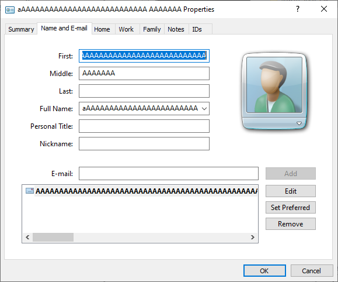
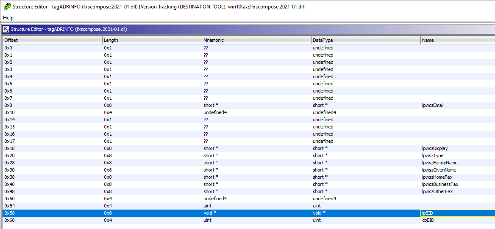
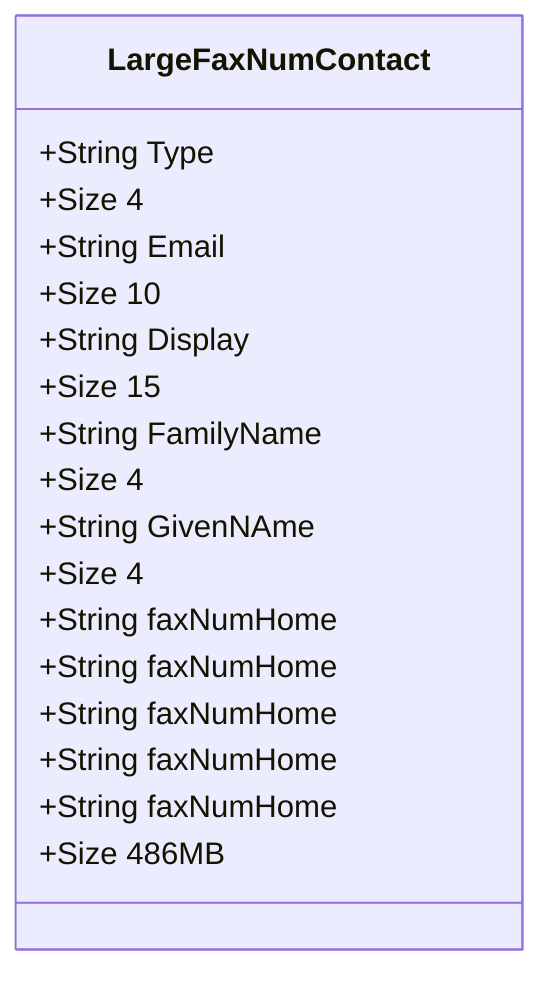
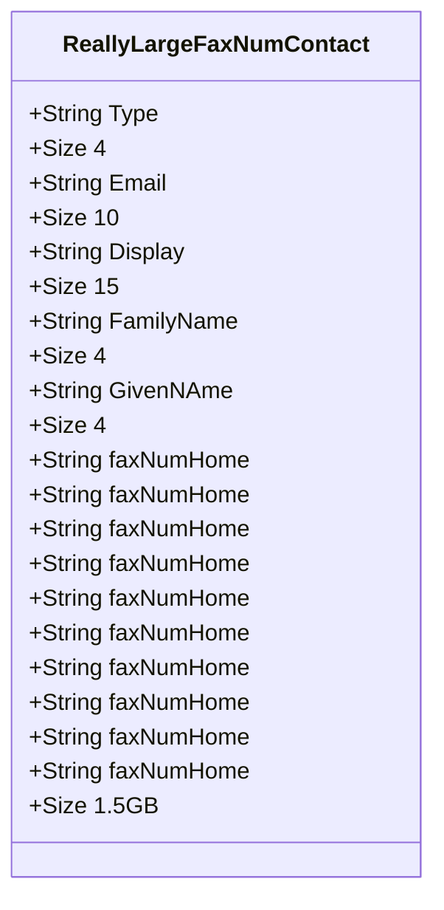
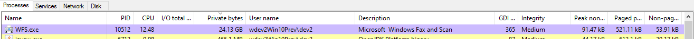
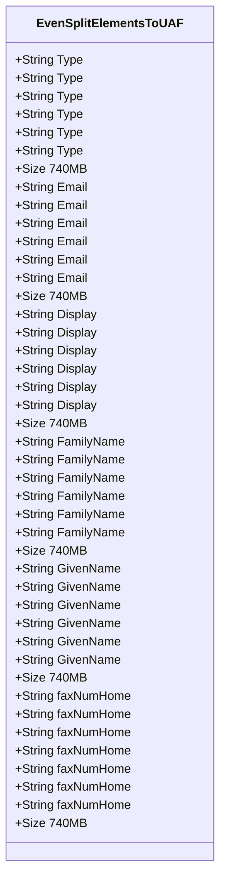
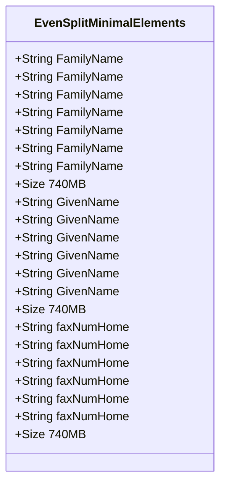
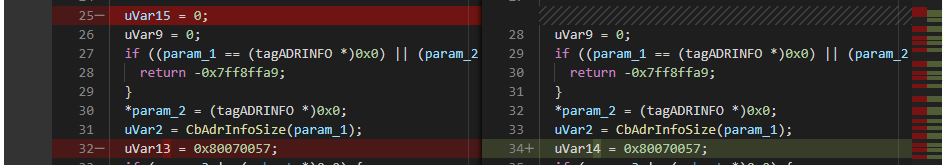
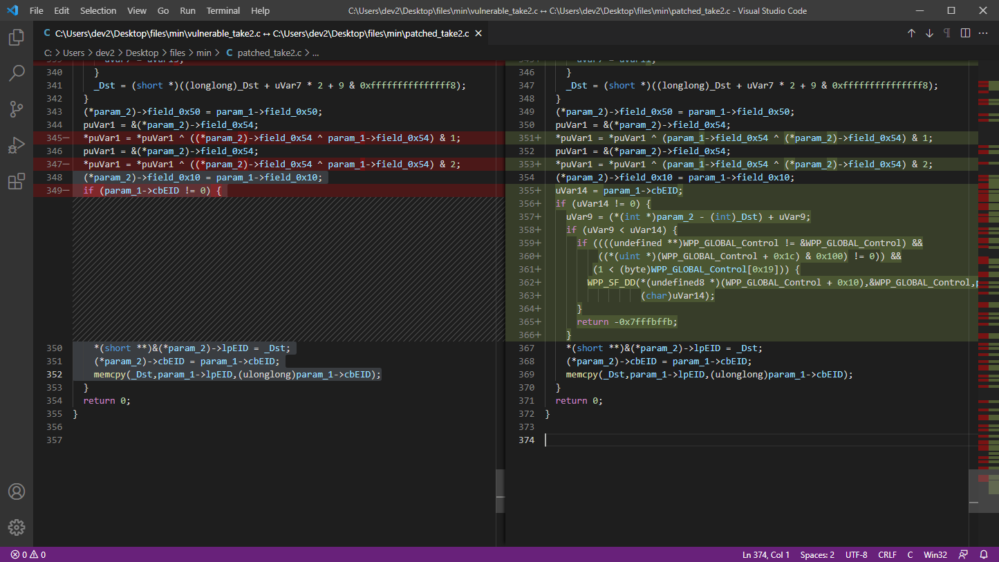
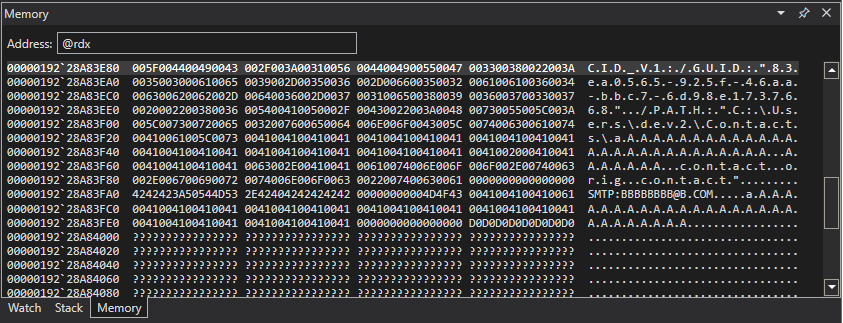

# Patch Diffing in the Dark 
---
# CVE-2021-1657 - Part 2 - Down the Rabbit Hole 
created: 2021-04-19
author: John M


<sub>Photo by [Dino Reichmuth](https://unsplash.com/@dinoreichmuth) on [Unsplash](https://unsplash.com/s/photos/stars-dark)</sub>

## The Rabbit Hole
OK, we left off last time by attempting to [patch diff In the dark](Patch%20Diffing%20In%20the%20Dark%20-%20CVE-2021-1657.md). We discovered an interesting function, `HrDupeAddrInfo`, that mostly seems to duplicate an object by allocating some memory and copying the relevant data from the original object. The function contained a questionable size calculation, so we ran WinDbg and attached to `WFS.exe` and discovered this function was copying (or `HrDup`licating) a [Windows Contact](https://en.wikipedia.org/wiki/Windows_Contacts)). With that context, let’s further analyze the suspect function and take a deeper look into the Windows Contact File Format. With luck, we can discover the vulnerability patched in [CVE-2021-1657](https://cve.mitre.org/cgi-bin/cvename.cgi?name=CVE-2021-1657). Let’s go. 

## Integer Overflow

Previously, I observed several variables within `HrDupeAddrInfo` that changed from  `ulong` to `ulonglong` and at this point; I am convinced that this is an integer overflow.  I knew what an integer overflow was, but it wasn't crystal clear and I needed to go do some more research. This is what I found. 

> An integer, in the context of computing, is a variable capable of representing a real number with no fractional part. Integers are typically the same size as a pointer on the system they are compiled on (i.e. on a 32 bit system, such as i386, an integer is 32 bits long, on a 64 bit system, such as SPARC, an integer is 64 bits long). [Basic Integer Overflows](http://phrack.org/issues/60/10.html#article)

Integers are a fixed size. A fixed size integer can only store a maximum fixed value depending on the number of bits used for its representation (2<sup>n</sup>-1).  The attempt to store a value larger than what can be represented by the allotted bytes will cause an **integer overflow**.

### Example
Sometimes things are easier to see with an example. 

#### Via Arithmetic
```c
UINT biggestUINT = 0xffffffff;
UINT more = 0x1;

unsigned int overflowed = 0;

overflowed = biggestUINT + more;

if (overflowed == 0) {
	printf('how did this happen?!\n');
}
```
<sub>*Example 1 - Integer overflow via arithmetic*</sub>

Essentially `0xffffffff + 0x1 = 0x100000000` which is then truncated (to the lowest 32 bits) `0x100000000 & 0xFFFFFFFF = 0`. This truncation also occurs when you try to assign the value of a larger size variable to a smaller one. 

#### Via Assignment
```c

ULONG result = 0;
ULONGLONG = 0xBBBBEEEEEEEEFFFF; 

...1000 lines of code...

result = someNumber; 

//result now == 0xEEEEFFFF


```
<sub>*Example 2 - Integer overflow via assignment*</sub>
	
Integer overflows can be difficult to spot. When variable declaration and use are separated by several lines of code, or variables are cast frivolously throughout the code, or several [other](https://www.geeksforgeeks.org/integer-promotions-in-c/) scenarios, things get a bit cloudy.  When trying to evaluate variable assignment, look at the assembly representation of the code as the truncation errors are more apparent. 

```
// result = someNumber; 

mov r13d, rax
```
<sub> Example 3 - 64-bit register `rax` being truncated to 32-bit register `r13d` </sub>


### Are They Dangerous?

>Integer overflows are not like most common bug classes. They do not allow direct overwriting of memory or direct execution flow control, but are much more subtle. The root of the problem lies in the fact that there is no way for a process to check the result of a computation after it has happened, so there may be a discrepancy between the stored result and the correct result. Because of this, most integer overflows are not actually exploitable. Even so, in certain cases it is possible to force a crucial variable to contain an erroneous value, and this can lead to problems later in the code. [Basic Integer Overflows](http://phrack.org/issues/60/10.html#article)

An integer overflow in itself is not dangerous, as it doesn't allow for overwriting of memory and most are not exploitable. The underlying issue with integer overflows is that once they occur, you are operating with incorrect data. This becomes dangerous when an overflowed integer is *used as a size for which to allocate a buffer* or *an index into an array*. If an integer can overflow one of these sizes, it can lead to other vulnerability classes such as a [buffer overflow](https://cwe.mitre.org/data/definitions/119.html). 

All right, I think we have a grasp on integer overflows. Yes there are [other](https://cwe.mitre.org/data/definitions/191.html) [kinds](https://cwe.mitre.org/data/definitions/194.html) as [well](https://cwe.mitre.org/data/definitions/195.html), but for our purposes the [basic](https://cwe.mitre.org/data/definitions/190.html) integer overflow will do. 

## Auditing HrDupeAddrInfo - Take 2

Here we go. 

Recall from [Patch Diffing In the Dark](Patch%20Diffing%20In%20the%20Dark.md#Function%20Call%20Tree%20-%20Outgoing%20Calls):

>- `CbAdrInfoSize` - calculate size
>- `MemAlloc` - allocate memory
>- `memset` - set memory
>- `StringCchCopyW` - copy data (string)
>- `memcpy` - copy data

 `HrDupeAddrInfo` seems to meet the criteria. It calculates a size based on the Windows Contact File, allocates a buffer based on the calculated size, and copies data to the new allocation. Smells like integer overflow to me. Specifically, this [brand](https://cwe.mitre.org/data/definitions/680.html) of integer overflow. Let's find this bug!

### Integer Overflow Size Requirements

```c
uVar2 = CbAdrInfoSize(param_1);
```

The size for the memory allocation calculated by `CbAdrInfoSize` is stored in a `ulong` result.  As mentioned, a `ulong` on Windows is 4 bytes.  For some perspective, take a look at the size ranges for the various [data types](https://docs.microsoft.com/en-us/cpp/cpp/data-type-ranges?view=msvc-160) on Windows:

| Type Name 	| Bytes 	| Other Names 	| Range of Values 	|
|:-:	|:-:	|:-:	|:-:	|
| bool 	| 1 	| none 	| false or true 	|
| char 	| 1 	| none 	| -128 to 127 by default   0 to 255 when compiled by using /J 	|
| signed char 	| 1 	| none 	| -128 to 127 	|
| unsigned char 	| 1 	| none 	| 0 to 255 	|
| short 	| 2 	| short int, signed short int 	| -32,768 to 32,767 	|
| unsigned short 	| 2 	| unsigned short int 	| 0 to 65,535 	|
| long 	| 4 	| long int, signed long int 	| -2,147,483,648 to 2,147,483,647 	|
| **unsigned long** 	| **4** 	| **unsigned long int** 	| **0 to 4,294,967,295** 	|
| long long 	| 8 	| none | -9,223,372,036,854,775,808 to 9,223,372,036,854,775,807 |
| unsigned long long 	| 8 	| none  	| 0 to 18,446,744,073,709,551,615 	|
| wchar_t 	| 2 	| __wchar_t 	| 0 to 65,535 	|

To overflow, we will need to reach a value greater than the max for a `ulong` ( `0xFFFFFFFF`). We *simply* need to create a Windows Contact File file larger than ~4.2GB. Is that even possible? Maybe. 

#### Impossible Overflow
```c
ulonglong uVar2; 
uVar2 = CbAdrInfoSize(param_1);
```

If `CbAdrInfoSize` and `HrDupeAddrInfo` would have stored the size in a `ulonglong` (max ~18,446,744,073 GB), we wouldn't even be having this conversation. 

### CbAdrInfoSize Algorithm

Time to dig into `CbAdrInfoSize` to figure out the details of the size calculation.  

<sub> *CbAdrInfoSize Function Prototype*</sub>
```c
ulong CbAdrInfoSize(tagADRINFO *param_1)
```

From our understanding of `HrDupeAddrInfo`, we know that `CbAdrInfoSize` is being fed a Windows Contact file (`param_1`) that seems to be represented by a  `tagADRINFO` data structure. We don't have the data type information, so the references to param1 throughout `CbAdrInfoSize` will be a bit opaque. For the purposes of calculating the size algorithm, this is fine. This becomes more important later when we try to create the ideal Windows Contact File. 

To begin, we look at the decompilation of `CbAdrInfoSize`. The function is pretty straightforward when you think about it in the context of calculating a size.  `CbAdrInfoSize` enumerates the `tagADRINFO` structure to determine whether pointers within the structure exist. If a pointer is not null, the length of the data pointed to is added to the total. 

```c
ulong CbAdrInfoSize(tagADRINFO *param_1)

{
  short *psVar1;
  uint uVar2;
  longlong lVar3;
  
  psVar1 = *(short **)(param_1 + 8)
  uVar2 = 0x68; 									[2]
  if (psVar1 != (short *)0x0) {
    lVar3 = 0x7fffffff;
    do {
      if (*psVar1 == 0) break;
      psVar1 = psVar1 + 1;
      lVar3 = lVar3 + -1;
    } while (lVar3 != 0);
    uVar2 = (-(uint)(lVar3 != 0) & -(uint)(lVar3 != 0) 
		& 0x7fffffffU - (int)lVar3) * 2 + 0x71 
		& 0xfffffff8;			 					[2]
  }
  psVar1 = *(short **)(param_1 + 0x18);
  if (psVar1 != (short *)0x0) {
    lVar3 = 0x7fffffff;
    do {
      if (*psVar1 == 0) break;
      psVar1 = psVar1 + 1;
      lVar3 = lVar3 + -1;
    } while (lVar3 != 0);
    uVar2 = uVar2 + (-(uint)(lVar3 != 0) & -(uint)(lVar3 != 0) 
		& 0x7fffffffU - (int)lVar3) * 2 + 9 
		& 0xfffffff8;								[2]
  }
  
  /*
  
  several more similar blocks of code...
  
  */
  
  return (ulong)(uVar2 + 0x208); // [1]
}
```
<sub> CbAdrInfoSize Decompilation </sub>

Despite its relative simplicity, its explanation is quite lengthy. Bear with me. 

Beginning at the end, the final size is returned in `uVar2` [1].  After `uVar2` is initialized, there are several similar blocks of code within the function that add to the size [2].  The repeated blocks seem like a macro or perhaps an [inlined](https://en.wikipedia.org/wiki/Inline_function) compiler optimization of a [string length check](https://docs.microsoft.com/en-us/windows/win32/api/strsafe/nf-strsafe-stringcchlengtha) function. 

#### In the Weeds

Focusing on one of the string length blocks helps us understand the specific calculation. From here on, let's rename a few variables to help guide the conversation.
- `uVar2` --> `uSize`  - keeping track of our total size throughout
- `psVar1` --> `psCurrentData` - pointer to the data relevant to the offset
- `lVar3` --> `lCount` - current count for data at offset

##### String Length Code Block

```c
  psCurrentData = *(short **)(param_1 + 0x18);  // [1]
  if (psCurrentData != (short *)0x0) {  [2]
    lCount = 0x7fffffff;  [3]
    do {  [4]
      if (*psVar1 == 0) break; [5]
      psCurrentData = psCurrentData + 1; [6]
      lCount = lCount + -1;  [7]
    } while (lCount != 0);  [8]
    uSize = uSize + (-(uint)(lCount != 0) & -(uint)(lCount != 0) & 0x7fffffffU - (int)lCount) * 2 + 9 & 0xfffffff8;  [9]
  }
```

 First, `psCurrentData` is set to the dereferenced pointer stored at  `param_1 + 18` [1]. If that pointer is not null [2], assign `lCount` to `0x7fffffff` (which happens to be `MAX_INT`) [3] and then iterate through the data at `*psCurrentData` [4]. In the loop, break when you hit a null [5] (a common stop for string iteration), otherwise advance the pointer [6] and subtract 1 from `lCount` [7].  If you reach a length of `MAX_INT`, break as well. [8] Finally, store the total count (or additional size) in `uVar2` . [9]. 

The most confusing line is [9]. This is where the newly calculated length is being added to the size in `uSize`:
```c
uSize = uSize + (-(uint)(lCount != 0) & -(uint)(lCount != 0) & 0x7fffffffU - (int)lCount) * 2 + 9 & 0xfffffff8;
```
<sub> Adding new count to the total `uSize`</sub>

The line alone is confusing, here is a pseudo-code rendering:
```c
if (lCount != 0) {  [1]
	uSize +=  (0x7fffffffU - (int)lCount) * 2 + 9);  [2]
	uSize = uSize & 0xfffffff8; [3]
}
```

If `lCount` did not reach `MAX_INT` [1], then add the length (difference of (`0x7fffffffU - (int)lCount`) \* 2) to the current size in `uSize`. The multiple of 2 likely has something to do with wide character strings `wchar` with a size of 2 [2]. Last, 8 byte align the size [3].  This is easier to understand.  

###### String Length Error Path Ignored

I know we are looking for an integer overflow, but I can't help mentioning that there is another [potential issue](https://cwe.mitre.org/data/definitions/131.html). This string length function assumes the length upper bound is `MAX_INT`. If the string count  reaches 0x7FFFFFFF before hitting a null byte, the loop breaks and the count **is never added to the size** [1]. An error is not handled, rather the result is `uSize += 0`.  Nothing is added to the size despite there being quite a bit of data! This *could* be an issue later if the data is written into a buffer which is now much too small. I digress.

#### Back up for air

Coming back to the `CbAdrInfoSize` calculation and ignoring some of the complexity just mentioned, the size algorithm can roughly summarized: 

```c
ulong CbAdrInfoSize(tagADRINFO *param_1)

{
  
  ulong uSize = 0x68;
  
  //assume lengthOfString has a limit of MAX_INT-1
  
  uSize += (2 * lengthOfString(*param_1 + 0x08)) & 0xfffffff8;
  uSize += (2 * lengthOfString(*param_1 + 0x18)) & 0xfffffff8;
  uSize += (2 * lengthOfString(*param_1 + 0x20)) & 0xfffffff8;
  uSize += (2 * lengthOfString(*param_1 + 0x28)) & 0xfffffff8;
  uSize += (2 * lengthOfString(*param_1 + 0x30)) & 0xfffffff8; 
  uSize += (2 * lengthOfString(*param_1 + 0x48)) & 0xfffffff8;
  uSize += (2 * lengthOfString(*param_1 + 0x38)) & 0xfffffff8;
  uSize += (2 * lengthOfString(*param_1 + 0x40)) & 0xfffffff8;
  
  return uSize + 0x208;  
 }

```

#### Integer Overflow Found!
OK. So, what is the maximum size we can generate? Can we overflow the integer (in this case `ulong`)??

**Yes!**, but not by as much as I thought at first.  From the summarized algorithm above, I initially thought we could overflow with this equation:

```
maxSize       = (2*(0x7FFFFFFF-1))*(8)
	          = 0x7FFFFFFE0
	          = 111 1111 1111 1111 1111 1111 1111 1110 0000
		        
               |***||-------------ulong--------------------|
		
```
<sub> Believed Max Integer Overflow </sub>

The real overflow is not quite that big, and it doesn't happen when `uSize` returns to `HrDupeAdrInfo`, rather it can occur each time the total size adds to `uSize` throughout  `CbAdrInfoSize`:

```c
// ulong uSize
uSize += (2 * lengthOfString(*param_1 + 0x08)) & 0xfffffff8;
uSize += (2 * lengthOfString(*param_1 + 0x18)) & 0xfffffff8;
```

In other words, `CbAdrInfoSize` is susceptible to several integer overflows each time the calculated string length adds to the current `uSize`. The integer overflow (via truncation) occurs every time `(size + additionalSize) > 0xFFFFFFFF`:

```
maxSize     = maxPreviousSize + maxAdditionalSize
            = 0xFFFFFFF8 + 0x7FFFFFFF
		    = 0x17FFFFFF7
		    = 1 0111 1111 1111 1111 1111 1111 1111 0111
			 |*||-------------ulong--------------------|

```
<sub> Actual Max Integer Overflow </sub>

About 5x less than I thought, but integer overflow nonetheless. Perfect. We now know that an integer overflow is possible, we just need to create a 2.1 GB Windows Contact...

## Getting To Overflow

In [part 1](Patch%20Diffing%20In%20the%20Dark%20-%20CVE-2021-1657.md#Triggering%20the%20BP), we set a breakpoint on `HrDupeAddrInfo` and by adding a contact to a fax compose form, hit the function in question. When I filled out the contact info, it looked like this:



That data was the stored on disk in a Windows Contacts XML File:
```xml
<?xml version\="1.0" encoding\="UTF-8"?>
<c:contact xmlns:c\="http://schemas.microsoft.com/Contact"
    xmlns:xsi\="http://www.w3.org/2001/XMLSchema-instance"
    xmlns:MSP2P\="http://schemas.microsoft.com/Contact/Extended/MSP2P"\>
<c:CreationDate\>2021-04-01T18:26:47Z</c:CreationDate\><c:Extended xsi:nil\="true"/>

<c:ContactIDCollection>
    <c:ContactID c:ElementID="03ba3084-e75f-48a0-b108-bde4bd53a44a">
        <c:Value>83ea0565-925f-46aa-bbc7-6d98e1737668</c:Value>
    </c:ContactID>
</c:ContactIDCollection>
<c:EmailAddressCollection>
    <c:EmailAddress c:ElementID="3df746f3-96cd-4662-9d7d-31c6861bcfd6">
        <c:Type>SMTP</c:Type>

        <c:Address>AAAAAAAAAAAAAAAAAAAAAAAAAAAAAAAAAAAAAAAAAAAAAAAAAAAAAAAAAAAAAAAAAAAAAAAAAAAAAAAAAAAAAAAAAAAAAAAAAAAAAAAAAAAAAAAAAAAAAAAAAAAAAAAAAAAAAAAAAAAAAAAAAAAAAAAAAAAAAAAAAAAAAAAAAAAAAAAAAAAAAAAAAAAAAAAAAAAAAAAAAAAAAAAAAAAAAAAAAAAAAAAAAAAAAAAAAAAAAAAAAAAAAAAAAAAAAAAAAAAAAAAAAAAAAAAAAAAAAAAAAAAAAAAAAAAAAAAAAAAAAAAAAAAAAAAAAAAAAAAAAAAAAAAAAAAAA...
```
<sub> Windows Contact XML File </sub>

Time now to figure out which XML elements actually contribute to the `CbAdrInfoSize` calculation in order to build an ideal integer overflow contact file.

### Contact File format

The best description of the *Windows Contact* file format I found was the [schema](https://docs.microsoft.com/en-us/previous-versions/windows/desktop/wincontacts/-wincontacts-schema-entry) provided by [MSDN](https://en.wikipedia.org/wiki/Microsoft_Developer_Network). A quick google search provided several samples of code that would build contacts [programmatically](https://docs.microsoft.com/en-us/windows/win32/api/_wincontacts/), leveraging Windows COM [interfaces](https://docs.microsoft.com/en-us/previous-versions//ms735866(v=vs.85)), and several other [technologies](https://github.com/vaginessa/VCF-Files-Tools). Wanting to avoid becoming an expert on Windows Contacts and rather simply have just enough information to get started, I went the simple route. I looked for a valid sample contact with several XML elements exercised, and modified it from there.

The best sample I found was hosted on the ad-laden fandom site [here](https://microsoft.fandom.com/wiki/Windows_Contacts#Example_Windows_Contact_file) which I realized later was just a copy of the [Windows Contacts](https://en.wikipedia.org/wiki/Windows_Contacts) Wikipedia entry albeit an [older snapshot](https://en.wikipedia.org/w/index.php?title=Windows_Contacts&type=revision&diff=976461762&oldid=636080162). The older snapshot contained a sample that was useful but had since been removed (why?). Whatever the reason, I now had a more complex sample:

```xml
<?xml version="1.0" encoding="UTF-8"?>
<c:contact xmlns:c="http://schemas.microsoft.com/Contact"
	xmlns:xsi="http://www.w3.org/2001/XMLSchema-instance" 
	xmlns:MSP2P="http://schemas.microsoft.com/Contact/Extended/MSP2P" c:Version="1">
	<c:Gender>Unspecified</c:Gender>
	<c:CreationDate>2009-04-01T14:20:31Z</c:CreationDate>
	<c:Extended xsi:nil="true" />
	<c:ContactIDCollection>
		<c:ContactID c:ElementID="f38b1a9b-08b1-409a-b8e3-e0b9ba4be1c3">
			<c:Value>5e26d97a-572b-4aea-8ee2-d225070acba0</c:Value>
		</c:ContactID>
	</c:ContactIDCollection>
	<c:EmailAddressCollection>
	
	<!--much more xml below-->
```

Now again, which elements actually matter for the size calculation in `CbAdrInfoSize`?

### Upgrading Lenses

Our current look at `CbAdrInfoSize` is a bit cloudy.. 

```
ulong CbAdrInfoSize(tagADRINFO *param_1)

{
  
  ulong uSize = 0x68;
  
  //assume lengthOfString has a limit of MAX_INT-1
  
  uSize += (2 * lengthOfString(*param_1 + 0x08)) & 0xfffffff8;
  uSize += (2 * lengthOfString(*param_1 + 0x18)) & 0xfffffff8;
  // more code below
```

We need a better picture of the `tagADRINFO` structure and what each of the offsets (`param_1 + 0x08`) actually refers to in the supplied contacts file. 

#### Cheating - aka leveraging Github

Turns out, a simple [github search](https://github.com/search?q=tagADRINFO&type=code) for `tagADRINFO` can reveal relevant data structures.

It reports back several interesting references. One even refers to a [tagadrinfo](https://github.com/PubDom/Windows-Server-2003/blob/5c6fe3db626b63a384230a1aa6b92ac416b0765f/inetcore/outlookexpress/mailnews/common/ipab.h#L110) data structure used within *[Outlook Express](https://en.wikipedia.org/wiki/Outlook_Express)*.

Now this code is outdated and the structure doesn't exactly match ours (most notably it doesn't even reference a fax number), but I bet it is similar. To update the structure for our use, we need to just try it.

#### Dynamic Discovery

Using the *Windows Contact* XML sample created and stepping through `CbAdrInfoSize` in *WinDbg*, the secrets can be revealed. I set the breakpoint on the function once more, this time recording the type of data present at each offset:

| Field Offset  | Specific Data |
| --- | --- |
|0x08 | `lpwszEmail` | 
|0x18 | `lpwszDisplay`|
|0x20 | `lpwszType`|
|0x28 | `lpwszFamilyName`|
|0x30 | `lpwszGivenName`|
|0x48 | `lpwszPreferredFax`|
|0x38 | `lpwszHomeFax`|
|0x40 | `lpwszBusinessFax`|
<sub>*Contact [schema](https://docs.microsoft.com/en-us/previous-versions/windows/desktop/wincontacts/-wincontacts-schema-entry)</sub>

#### Adding Relevant Data Structures in Ghidra

We can add the `tagADRINFO` data structure to Ghidra in [multiple ways](https://ghidra.re/courses/GhidraClass/Advanced/improvingDisassemblyAndDecompilation.pdf). We could create a header file and file it with a `struct tagADRINFO` similar to the old sample above. Ghidra could then [automatically parse it](https://www.tripwire.com/state-of-security/security-data-protection/ghidra-101-creating-structures-in-ghidra/) and add it to it's known set of data types. It can also be done manually within Ghidra's *Structure Editor*, which I found to be easier having already decoded the necessary field offsets. 



#### CbAdrInfoSize New View

```c
ulong CbAdrInfoSize(tagADRINFO *param_1)
{
  
  ulong uSize = 0x68;
  
  //assume lengthOfString has a limit of MAX_INT-1
  
  uSize += (2 * lengthOfString(lpwszEmail)) & 0xfffffff8;
  uSize += (2 * lengthOfString(lpwszDisplay)) & 0xfffffff8;
  uSize += (2 * lengthOfString(lpwszType)) & 0xfffffff8;
  uSize += (2 * lengthOfString(lpwszFamilyName)) & 0xfffffff8;
  uSize += (2 * lengthOfString(lpwszGivenName)) & 0xfffffff8; 
  uSize += (2 * lengthOfString(lpwszHomeFax)) & 0xfffffff8;
  uSize += (2 * lengthOfString(lpwszBusinessFax)) & 0xfffffff8;
  uSize += (2 * lengthOfString(lpwszOtherFax)) & 0xfffffff8;
  
  return uSize + 0x208;  
 }
```

A much improved look for our size function. And helpful when trying to identify which XML elements contribute to the calculated size. 

Great, we now know how to build our file. Time to go big. 

### Creating a Large Windows Contact File

Before you laugh, just remember I'm going for quantity (>2.1GB) over quality. Besides, for creating large files, `cat` and `dd` are about as fast as you can get. I began with a simple bash script that would generate a contact.xml file with a large entry for the email entry. 

```bash
dd if=firstpart.xml of=new_file
cat faxnum_pre.txt >> new_file
cat faxnum_pre.txt >> new_file
cat faxnum_pre.txt >> new_file
cat faxnum_pre.txt >> new_file
cat faxnum_pre.txt >> new_file
cat lastpart.xml >> new_file

du -h new_file

mv new_file ~/Contacts/large_faxnum_field.contact
```

This would build a contact with several elements with a very large home fax number. The file `faxnum_pre.txt` was about ~100MB of `A`s. This created `large_faxnum_field.contact` at about 486MB.  


<sub>Rough breakdown of `large_faxnum_field.contact` XML content</sub>

The `uSize` returned from  `CbAdrInfoSize` as a result was `0x3092aab0`. In decimal this is 815MB (about 2x the input) and is ~1/5 of the way to overflow. The first test was to understand if there were limits to size on individual fields. I mean, surely they [limit their input size](https://cwe.mitre.org/data/definitions/770.html)?    

Seems `WFS.exe` is happy with a 400 MB fax number full of AAAs. That's a good sign. OK. We know how to build a contacts file, we know the fields that are used, and we now believe that they don't check field input size. Can we overflow? **No problem.**

### Problems

Working with files trying to cause integer overflows based simply on a length count implies massive files. We have seen already that our string data within the XML is  multiplied by 2, but that still leaves us with the task of creating a 2.1GB file *Windows Contact* file.

#### Large Single Element Allocations

<sub>Rough breakdown of `really_large_faxnum_field.contact` XML content</sub>
When I bumped up the *large_faxnum_filed.contact* to 1.5GBs of fax number, I received an unknown exception on some sort of `alloc` call. Perhaps an E_OUTOFMEMORY error?

```
(2ef8.1528): Unknown exception - code e0000002 (first chance)
(2ef8.1528): Break instruction exception - code 80000003 (first chance)
msxml6!BlockAlloc::EnqueueBlock+0x612a6:
```

The stack reveals a bit more. 

```
0:000> k
 # Child-SP          RetAddr               Call Site
00 00000036`d33ac0a0 00007ffd`64d3b9cc     msxml6!BlockAlloc::EnqueueBlock+0x61 
01 00000036`d33ac0d0 00007ffd`64c7a91f     msxml6!BlockAlloc::RequeueBlock+0x2c 
02 (Inline Function) --------`--------     msxml6!BlockAlloc::AllocData+0xa657d 
03 00000036`d33ac100 00007ffd`64bd4019     msxml6!Reader::ParseElementN+0xa6bcf 
04 00000036`d33ac2e0 00007ffd`64bd4019     msxml6!Reader::ParseElementN+0x2c9 
05 00000036`d33ac4c0 00007ffd`64bd4019     msxml6!Reader::ParseElementN+0x2c9 
06 00000036`d33ac6a0 00007ffd`64bd5904     msxml6!Reader::ParseElementN+0x2c9 
07 00000036`d33ac880 00007ffd`64bd5686     msxml6!Reader::ParseDocument+0x108 
08 00000036`d33ac8b0 00007ffd`64c1521c     msxml6!Reader::Parse+0x1a 
09 00000036`d33ac900 00007ffd`64c14d0e     msxml6!Reader::parse+0x11c 
0a 00000036`d33ac960 00007ffd`538c9e0f     msxml6!SAXReader::parse+0x16e 
0b 00000036`d33ac9e0 00007ffd`538c1113     wab32!CSAXProperties::_InitSAX+0x183
0c 00000036`d33aca80 00007ffd`538c0d0f     wab32!CContact::_Load+0x25f
0d 00000036`d33acc00 00007ffd`538cb658     wab32!CContact::Load+0x1cf
0e 00000036`d33acca0 00007ffd`538cd91e     wab32!CreateContactFromFile+0x100
```

Likely to do with the fact that the contacts file is XML, and loaded and parsed by external libraries like `msxml`. When data is passed around, copies are made. Likely, several copies...



The *private commit* (virtual memory allocated) for `WFS.exe` jumped several times to about ~22GBs. 

#### Paging
`WFS.exe` was not the only one trying to load and parse this contacts file.  Both `explorer.exe` (when the Contacts folder was open), `MsMpEng.exe` and `SearchIndexer.exe` (before I disabled them for my test folder) were attempting to load the contacts file as well. Which didn't help my test machine, causing memory to [thrash](https://en.wikipedia.org/wiki/Thrashing_(computer_science)), exceptions to throw, and my system to slow to a halt.

#### Not All Elements Created Equal 
During testing, I found some elements caused more allocations than others. I discovered this when trying to minimize large allocations by splitting the data evenly across elements.  



When attempting this split method, my system would hang with larger commits or I would end up with unknown exceptions or more serious issues **within other modules**. 

##### Use After Free???! 

Again, during the `wab32` parsing of my large contacts file, it seems like there is a potential use after free.   
```
(2574.a08): Access violation - code c0000005 (first chance)
First chance exceptions are reported before any exception handling.
This exception may be expected and handled.
wab32!UlcbPropToCopy+0x177:
00007ffd`538666a3 4c8b19          mov     r11,qword ptr [rcx] ds:0000022c`6786efe0=????????????????
```

`rcx` looks like a valid heap allocation `0x22c6786efe0`, but is no longer mapped. 
```
0:000> !address rcx

Usage:                  PageHeap
Base Address:           0000022c`6786d000
End Address:            0000022c`67872000
Region Size:            00000000`00005000 (  20.000 kB)
State:                  00002000          MEM_RESERVE
Protect:                <info not present at the target>
Type:                   00020000          MEM_PRIVATE
Allocation Base:        0000022c`66cb0000
Allocation Protect:     00000001          PAGE_NOACCESS
More info:              !heap -p 0x22c66cb1000
More info:              !heap -p -a 0x22c6786efe0

Content source: 0 (invalid), length: 3020
```

Asking the debugger we get a little more info:

```
0:000> !heap -p -a 0x22c6786efe0
    address 0000022c6786efe0 found in
    _DPH_HEAP_ROOT @ 22c66cb1000
    in free-ed allocation (  DPH_HEAP_BLOCK:         VirtAddr         VirtSize)
                                22c66cd8d68:      22c6786e000             2000
    00007ffd7abe8fa4 ntdll!RtlDebugFreeHeap+0x0000000000000038
    00007ffd7ab15cc1 ntdll!RtlpFreeHeap+0x00000000000000c1
    00007ffd7ab15b74 ntdll!RtlpFreeHeapInternal+0x0000000000000464
    00007ffd7ab147b1 ntdll!RtlFreeHeap+0x0000000000000051
    00007ffd786f6c7f KERNELBASE!LocalFree+0x000000000000002f
    00007ffd5387607c wab32!LocalFreePropArray+0x0000000000000194
    00007ffd53851099 wab32!CContactStorage::FreeContentList+0x0000000000000039
    00007ffd53848057 wab32!FillTableDataFromPropertyStore+0x000000000000049f
    00007ffd53848123 wab32!CContainerView::SetColumns+0x0000000000000033
    00007ffd538a40f0 wab32!SetRecipColumns+0x00000000000000d8
    00007ffd538a4260 wab32!HrGetWABContentsList+0x000000000000014c
    00007ffd5388ab42 wab32!FillListFromCurrentContainer+0x0000000000000166
    00007ffd5388bc15 wab32!fnAddress+0x0000000000001055
    <several more return addresses>
    00007ffd538d5d4e wab32!SHFusionDialogBoxParam+0x000000000000006a
    00007ffd5388a8dc wab32!HrShowAddressUI+0x0000000000000210
    00007ffd5385e09b wab32!AddressBook::Address+0x000000000000002b
    00007ffd53952956 FxsCompose!CAddrWells::HrSelectNames+0x00000000000002e6
    00007ffd53940376 FxsCompose!CNoteHdr::HrPickNames+0x000000000000002a
    00007ffd5393ddc1 FxsCompose!CNoteHdr::WMCommand+0x00000000000000a1
    00007ffd5393d7e7 FxsCompose!CNoteHdr::CNoteHdrWndProc+0x00000000000002ef
```

Looking at the stack trace, we can see how the allocation was freed.  I guess everyone has trouble handling a large contacts file. Once again, I digress.

#### Data Duplication Optimization?

Reading the aforementioned [old wikipedia Windows Contacts entry](https://en.wikipedia.org/w/index.php?title=Windows_Contacts&oldid=470177312#Example_Windows_Contact_file), there was an interesting note about data duplication. 

> The XML code could be simplified in case of data duplication. For example if the business address and the home address are the same, it could be simplified by adding a Label Business and a Label Personal to a PhysicalAddress:

```xml
<c:PhysicalAddressCollection>
	<c:PhysicalAddress c:ElementID="d63a50ea-bf80-45b1-a293-73345b58adcd">
		<c:Country>United States of America</c:Country>
		<c:PostalCode>30314</c:PostalCode>
		<c:Region>LA</c:Region>
		<c:Locality>Baytown</c:Locality>
		<c:Street>100 Waters Edge</c:Street>
		<c:LabelCollection>
			<c:Label>Business</c:Label>   [1]
			<c:Label>Personal</c:Label>	  [1]
		</c:LabelCollection>
	</c:PhysicalAddress>
</c:PhysicalAddressCollection>
```
<sub> Windows Contact File Shared Labels </sub>

Data duplication! This might be my saving grace!  I could create a single large fax number entry and just add the labels (Home,Business, Preferred) [1] and have my single Fax number data element counted 3x!! 

Unfortunately, when the *Windows Contact* files has multiple fax numbers, only one of the fax numbers counts for the total size. Likely a result of the following stack trace:

```
00 0000000f`477ad4f8 00007ffd`53876441     wab32!RemoveDuplicateProps
01 0000000f`477ad500 00007ffd`5385b408     wab32!ScMergePropValues+0xd1
02 0000000f`477ad580 00007ffd`5385b9db     wab32!HrAddPrSearchKey+0x2a0
03 0000000f`477ad630 00007ffd`538a7fd7     wab32!AddressBook::OpenEntry+0x4bb
04 0000000f`477ad6e0 00007ffd`5388b274     wab32!HrGetPropArray+0x5f
05 0000000f`477ad740 00007ffd`7a232920     wab32!fnAddress+0x6b4
```


### Creating the Optimal Overflow Contact file

OK, so there are many ways *not* to create a large contacts file. 

#### Minimize allocations
Through trial and error, I found the most stable elements to use. These elements didn't seem to be duplicated (as much) and I was able to build a file that I was sure would hit the mark. 



This file doesn't cause exceptions, reduces the number of extra allocations, and wastes as little bytes as possible on data that doesn't contribute to `uSize`. The total contacts XML file size seemed to have to remain below the `MAX_INT` size, or I would hit those use after free or what seemed to be  E_OUTOFMEM errors in `wab32`. 

The final heap allocation to store my `tagADRINFO` struct representing my `msxml` parsed `EvenSplitMinimalElements.contact` XML was 2.62GB.

```
FxsCompose!CbAdrInfoSize+0x61:
00007ff9`e2c6aee1 4885c0          test    rax,rax
0:000> !address rax

Usage:                  PageHeap
Base Address:           0000020e`70bc0000
End Address:            0000020f`1bbb5000
Region Size:            00000000`aaff5000 (   2.672 GB)
State:                  00001000          MEM_COMMIT
Protect:                00000004          PAGE_READWRITE
Type:                   00020000          MEM_PRIVATE
```
<sub> WinDbg !address rax (pointing to `tagADRINFO param1`)</sub>

Each *string length code block* (referenced above) gave me ~`0x5500a67e` and the final `uSize` returned from `CbAdrInfoSize` was `0xfffff458`!!   

### So Close, Yet So Far

```
   0xffffffff
-  0xfffff458
_____________
   0x00000BA7
   
   2,983 bytes
```
After my best effort, I was ~`3K` bytes away from overflow. So close! There is definitely an overflow possible here, but each time I build a large contacts file I get some sort of exception or my test machine grinds to a halt. Ah!

#### Summary Results
|Filename | Size | Allocations Caused | Exception Triggered|  CbAdrInfoSize | Distance From Overflow|
|---|---|---|---|---|---|
|`LargeFaxNumContact` | 486 MB | 16 GB | None | 0x | `0xCF6D554F` (3.1GB) |
|`ReallyLargeFaxNumContact` | 1.5GB | 12 GB | E_OUTOFMEM? | N/A | N/A |
| `EvenSplitFieldsToUAF` | 2.1GB | N/A | Use After Free? | N/A | N/A |
|`EvenSplitMinimalElements` | 2.1GB | 26GB | N/A | `0xfffff458` | `0xBA7` (~3KB)  | 

After more trial and error, this was the best I could do. *Motivation decreased*. Then something hit me. 
 
## This Isn't the Bug You're Looking For

This whole time I'm focused on creating the perfect contacts file, I'm ignoring the fact that **this integer overflow exists in the current version**. The integer overflow is distinct from the bug patched in CVE-2021-1657!! *Motivation increased*. 

If this isn't the bug, then what was?

### CVE-2021-1657 - The Bug You're looking For

The assumptions I made before about the variables changing from `ulong` to `ulonglong` were incorrect. It turns out; the diffs highlighted were because of the random variable names assigned by the Ghidra decompiler. The additional variables on the stack made things a bit more confusing (or at least that is my excuse). 

Taking another look at the patch diff for the `HrDupAdrInfo` [decompilation](Patch%20Diffing%20In%20the%20Dark%20-%20CVE-2021-1657.md#Decompilation), we can see the patch didn’t relate to integer types at all. New variables added yes, but the `ulong uSize` result from `CbAdrInfo` remained the same type.


<sub>Comparison of `CbAdrInfo` between vulnerable and patched `fxscompose.dll`</sub>

Most of the code that was added (all that green below) was due to the addition of a [Windows Software Trace Preprocessor](https://docs.microsoft.com/en-us/windows-hardware/drivers/devtest/wpp-software-tracing) (WPP) call. Essentially, a function that can send logs and error details back to Microsoft. Details of WPP and how it can be useful for security research can be found [here](https://posts.specterops.io/data-source-analysis-and-dynamic-windows-re-using-wpp-and-tracelogging-e465f8b653f7).



More interesting is where and why they added the WPP call. It seems to be called if a new bounds check fails, which I believe is the exact issue that was patched. Perhaps the WPP call might be a way to find out if the patch is working?? The speculation continues...

#### Additional Bounds Check Preventing Heap Buffer Overflow

Let's take a look:

<sub> Relevant code in `HrDupeAdrInfo` in vulnerable `fxscompose.dll`</sub>
```c
  if (param_1->cbEID != 0) {
    *(short **)&(*param_2)->lpEID = _Dst;
    (*param_2)->cbEID = param_1->cbEID;
    memcpy(_Dst,param_1->lpEID,(ulonglong)param_1->cbEID);
  }
  return 0;
```  

This vulnerable code copies data `lpEID` of length `cbEID` into the buffer allocated to store the new `tagADRINFO param_2` object of `uSize`.  The danger is that the copy could cause an overflow if the space left in the allocation of `_Dst` of length `uSize`  was too small to hold the length `cbEID`. 

The new code adds a bounds check to prevent this:

<sub> Relevant code in `HrDupeAdrInfo` in patched `fxscompose.dll`</sub>
```c
  uVar14 = param_1->cbEID;
  if (uVar14 != 0) {
    uVar9 = (*(int *)param_2 - (int)_Dst) + uVar9;  [1]
    if (uVar9 < uVar14) {					        [2]
		<WPP Call> // removed for simplicity
      return -0x7fffbffb;
    }
    *(short **)&(*param_2)->lpEID = _Dst;
    (*param_2)->cbEID = param_1->cbEID;
    memcpy(_Dst,param_1->lpEID,(ulonglong)param_1->cbEID);
  }
  return 0;
```

The check [2] is ensuring that `cbEID` is less than the amount of space left in in allocated buffer [1]. At this point, we don't know exactly what this `cbEID` is or what data is held in `lpEID`, so we take a look in the debugger:


<sub>`RDX -> lpeid` - WinBbg -Memory Windows </sub>

It seems to be some sort of reference to the original object, in this case the path name of the contacts file. This would likely be different if the source of the contact was from a [LDAP](https://en.wikipedia.org/wiki/Lightweight_Directory_Access_Protocol) server or on some other file share. Perhaps, this is the *remote* aspect from the CVE description??  In any case, this bounds check is required, as there **is no account for the length `cbEID` in `CBAdrInfoSize`**.  

To demonstrate, I extended the file name of my contact to the Windows [`MAX_PATH`](https://docs.microsoft.com/en-us/windows/win32/fileio/maximum-file-path-limitation?tabs=cmd) of 260 and the *WPP* call path was taken. On a vulnerable version with [*PageHeap*](https://docs.microsoft.com/en-us/windows-hardware/drivers/debugger/gflags-and-pageheap) enabled via *GFlags*, an access violation is thrown as memory past the allocation within `HrDupeAdrInfo` is written to.    

```
(a1c.b64): Access violation - code c0000005 (first chance)

msvcrt!memcpy+0xd2:
000007fe`ffa11229 488941f0        mov     qword ptr [rcx-10h],rax ds:00000000`1ce82000=????????????????
```

This unchecked `cbEID` in the vulnerable `fxscompose.dll` causes the same issue ([heap buffer overflow](https://cwe.mitre.org/data/definitions/122.html)) as the integer overflow we have been seeking, with the exception that it provides much more control (as in smaller overwrite).  

### The Quest for CVE-2021-XXXX - Integer Overflow

The integer overflow is there in `CbAdrInfoSize`.  I can see it! I just can't seem to trigger it. Despite this current failure, I want to ask the question. 

#### Are You Convinced Yet?
Are you convinced yet of the conclusions regarding patch diffing:
>- is **a single source of truth** when there is no other information
>- **provides clarity** in vulnerability comprehension and discovery
>- can be an excellent candidate for **improving your competence** via deliberate practice. It is complex and challenging yet tractable with the help of today's SRE tooling.

This journey that we have been on came from a simple CVE description. An argument can be made that we haven't accomplished much yet, but I feel my (our?) competence improving. My understanding of the *Windows Fax and Scan App* has skyrocketed, and all I have been doing throughout this process is learning about vulnerability classes and staring at its security relevant code. If this isn't a vote in favor of leveraging patch diffing to find truth, clarity, and understanding, I don't know what is.  

We have found an integer overflow in `CBAdrInfoSize`. It is there, I just can't seem to create a Windows Contact file to trigger the overflow due to memory exceptions, time, and my current level of understanding. Over the course of a week, some more time spent, and a unique realization about this vulnerable function `CbAddrInfo` helped realize I was [down but not out](Patch%20Diffing%20in%20the%20Dark%20-%20CVE-2021-1657%20-%20Part%203%20-%20Down%20But%20Not%20Out.md)

---


